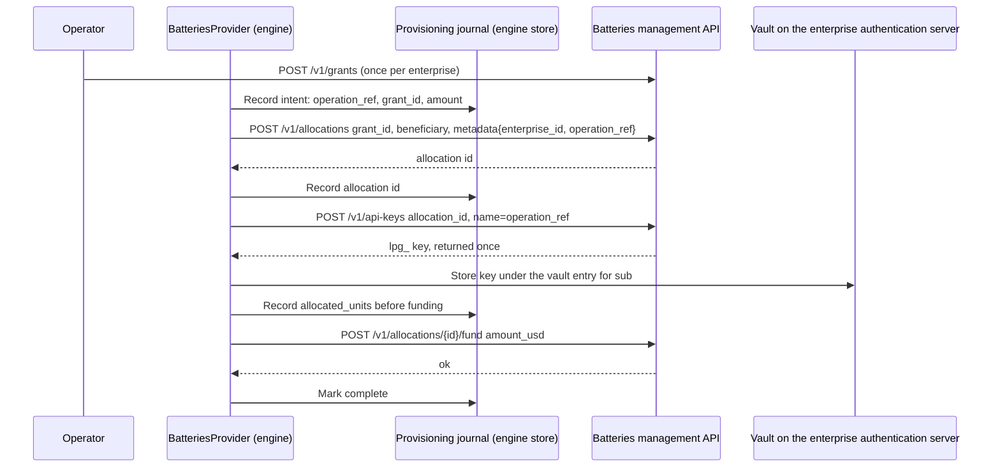

# Batteries Management Integration

**Status:** Draft for review\
**Updated:** 1 October 2026\
**Context:** [Payment provisioning modes](payment-provisioning-modes.md), [enterprise authorization server](enterprise-authorization-server.md), [Clearinghouse configuration](clearinghouse-configuration.md), [builder-layer proposal](../references/analysis/2026-10-01-Builder-Layer-Abstraction-and-Two-Application-Review.md)

The builder engine can provision payment allocations today. Clearinghouse Batteries has served a management HTTP API on `main` since 23 September, so the `PaymentProvider` adapter can be written without waiting on the maintainer.

The integration runs in two phases:

- **Phase A, single tenant.** The enterprise gateway acts as a reseller with one wholesale grant. It needs no Batteries change.
- **Phase B, multi-tenant.** A tenant layer in the engine, closer to the PymtHouse model. It also leaves Batteries unchanged. Upstream changes are optional asks that make both phases cheaper; none of them blocks Phase A.

No Cloud SPE decision record accepts this contract yet.

## The payment boundary

Batteries and the go-livepeer remote signer are the payment path in both payment modes. Mode A is self-operated; in Mode B a hosted operator runs Batteries and the signer, and the engine holds `lpg_` keys under a grant that operator provides. Three roles follow:

| Role | Owns | Does not own |
| --- | --- | --- |
| Enterprise app and its issuer | Users, retail prices, user balance checks before a job is submitted | Network cost, signing |
| Engine | Jobs, attempts, network-cost projection, Batteries provisioning | Retail prices, user balances |
| Batteries and the remote signer | The allowance, enforced at signing; network cost in USD | Retail prices |

- **The allowance is a hard cap at signing.** The signer calls its `-remoteSignerWebhookUrl` during `GenerateLivePayment`. Batteries answers that webhook, resolving the `lpg_` key to its allocation and refusing with 402 when `allocation_available` is zero.
- **Batteries meters network cost, not retail cost.** It debits allocations by the ticket event's `computed_fee_usd` and applies no markup.
- **Allocation and key creation are requirements.** The balance check works per key, so any per-tenant or per-user cap needs its own allocation and key, created through the management API.
- **External billing systems are adapters, not payment providers.** Kong, PymtHouse or Stripe attach through a `BillingAdapter` that consumes engine usage and cost events. It never authorizes signing.

## Evidence

Reviewed 1 October 2026 against [`livepeer/clearinghouse-batteries`](https://github.com/livepeer/clearinghouse-batteries) `main` at `9cf68d6`. The management API arrived in `a2ed175` "Add management API" (23 September 2026). Service credentials arrived in `9cf68d6` "API auth (#4)" (30 September 2026).

| Claim | Source |
| --- | --- |
| Routes, permissions and body rules | `internal/app/management.go` |
| Credential registry and permission vocabulary | `internal/serviceauth/registry.go`, `creds.example.toml` |
| Serve flags | `internal/app/server.go` `ServeParams` |
| Create, fund, revoke and key semantics | `internal/store/manage.go` |
| Ledger report shape | `internal/store/store.go` `Report` |
| Signer authorization webhook, 402 on exhaustion | `internal/auth/http.go`, `internal/store/auth.go`; go-livepeer `server/remote_signer.go` at `773734d9` |
| Allocation debit from `computed_fee_usd` | `internal/store/ingest.go` |

The 26 September discussion with the maintainer took place before this API was pushed. The [provisioning](payment-provisioning-modes.md) and [Clearinghouse configuration](clearinghouse-configuration.md) drafts are updated to match.

## The management API today

`serve --enable-management-api :PORT` starts a second HTTP listener. It must use a different port from the signer webhook. It binds to loopback unless `--unsafe-http-bind` is set. `--creds-file` is required.

Every resource route checks the `Livepeer-Clearinghouse-Token` header against a `management` credential whose `allow` list names the permission. Credentials load once from a TOML or JSON file. A permission covers every resource of its type. No credential is scoped to one grant.

| Method and path | Permission | Behaviour that matters to the engine |
| --- | --- | --- |
| `POST /v1/grants` | `grants.create` (+ `grants.fund` if funded) | One grant is one customer budget. `sponsor`, `metadata`, a time window |
| `POST /v1/grants/{id}/fund` | `grants.fund` | Adds to the grant's unallocated balance |
| `POST /v1/allocations` | `allocations.create` (+ `.fund` if funded) | Requires `grant_id`. Accepts `beneficiary` and opaque `metadata`. Amount defaults to zero |
| `POST /v1/allocations/{id}/fund` | `allocations.fund` | Moves grant funds in. Raises `allocated_units`. `all` drains the grant |
| `POST /v1/allocations/{id}/revoke` | `allocations.revoke` | Returns the unused balance to the grant. Repeating it is harmless |
| `PATCH /v1/allocations/{id}/status` | `allocations.status` | `active` or `paused` only |
| `POST /v1/api-keys` | `api_keys.create`, plus `allocations.create` and `.fund` when given `grant_id` | Exactly one of `allocation_id` or `grant_id`. Returns `lpg_` once. With `grant_id`, it creates a funded allocation and the key together |
| `POST /v1/api-keys/{id}/revoke` | `api_keys.revoke` | Ends later authorizations on that key |
| `GET /v1/grants`, `/v1/allocations` (and `/{id}`) | `*.read` | Allocation rows carry `allocated_units`, not the available balance |
| `GET /v1/api-keys` | `api_keys.read` | Id, allocation, name, prefix and timestamps. No item route |
| `GET /v1/usage` | `usage.read` | Event id, status, fees and time. No allocation, session or manifest. No cursor |
| `GET /v1/ledger/report` | `ledger.read` | Every account balance, including `allocation_available` per allocation |
| `GET /v1/sessions`, `/v1/settlements`, `/v1/escrow/*` | `*.read` | Operator evidence |

Bodies are flat string fields in JSON or form encoding, at most 1 MiB, and unknown fields are refused. Errors are JSON `{"error"}` with status 400, 404, 409, 413 or 415. Failed authentication is plain text 401 or 403.

## Phase A: single-tenant reseller

The enterprise gateway is the only customer of one Batteries deployment. That deployment may be self-operated or run by a hosted operator.

- The operator creates **one grant per enterprise** once, with the CLI or `POST /v1/grants`.
- The engine's `BatteriesProvider` creates allocations under that grant, mints keys, funds and revokes. Allocations may be split per environment (CI, production) or per end user.
- End users never appear in Batteries.



### Least-privilege credential

The engine holds one `management` credential with no grant permissions:

```toml
[[credentials]]
id = "builder-engine"
secret = ""  # mounted from the deployment's secret store
[credentials.management]
allow = ["allocations.create", "allocations.fund", "allocations.read", "allocations.revoke",
         "api_keys.create", "api_keys.read", "api_keys.revoke", "usage.read", "ledger.read"]
```

The engine therefore cannot create, fund or close grants; creating and funding grants stays an operator action. The credential stays server-side in both integration modes. It is not the signer's `webhook` credential and never reaches a caller.

### Retry safety without upstream idempotency

Batteries mints a fresh ledger key for every fund call and a fresh id for every create. A blind retry therefore posts twice. The provider uses separate steps instead of the atomic `grant_id` key path, so each step can be checked before a retry:

| Step | Effect of a lost response | Reconciliation before retry |
| --- | --- | --- |
| Create allocation | Allocation may exist | List allocations under the grant; match `metadata.operation_ref` |
| Create key | Key may exist, secret unrecoverable | Mint a new key on the same allocation; revoke every key named `operation_ref` that the vault does not hold |
| Fund allocation | Funds may have moved | Re-read `allocated_units`; it equals the journaled value plus the amount when the fund applied |
| Revoke | None | Safe to repeat |

The fund check assumes the engine is the only party funding its allocations. An operator who funds by hand must do so through the journal or pause provisioning. Revocation is the only remedy for an over-fund: it returns the unused balance to the grant and ends sessions bound to that allocation's keys.

### Balance, usage and cost

| Need | Phase A source | Limit |
| --- | --- | --- |
| `PaymentProvider.allowance` | `GET /v1/allocations/{id}` for granted; `GET /v1/ledger/report` row `allocation_available` for remaining | The report returns every account. The engine filters it client-side |
| Per-job network cost | `--usage-export-topic` CloudEvents, joined on `manifest_id` ([usage export](usage-event-export.md)) | Waits on [netspe-cz5.11](usage-event-export.md#work-this-design-implies). Until then, job cost stays `pending` |
| Allocation spend | Ledger report `allocation_spent` | Aggregate only |
| Prepaid session starts refused on capacity | None today | The signer reports no per-attempt payment event, so a failed prepaid start is invisible to the engine. Asked of go-livepeer; until then the attempt is `payment_sent` and its cost `pending` |

`GET /v1/usage` cannot attribute an event to an allocation, so the engine does not build job cost from it.

## Upstream asks

None of these blocks Phase A. Each one removes a workaround above. In priority order:

1. **Caller idempotency** on grant, allocation and api-key create, and on fund: an `Idempotency-Key` header, or a caller-supplied ledger key. This replaces the journal reconciliation.
2. **Narrow reads.** Add `available` and `spent` to `GET /v1/allocations/{id}`, `grant_id` and `allocation_id` filters on list routes, and `GET /v1/api-keys/{id}`. This replaces the client-side report filter.
3. **Attributed usage with a cursor.** Add allocation, payment session, request, pipeline and `manifest_id` to `/v1/usage`, with `allocation_id`, `after` and `limit` parameters. This would give the engine a pull path equivalent to the fork-only cost-events read API that the [proposal](../references/analysis/2026-10-01-Builder-Layer-Abstraction-and-Two-Application-Review.md#upstream-interfaces-the-layer-wraps) assumes. The export topic remains the push path.

## Phase B: multi-tenant

Phase B serves several enterprises (tenants) from one engine and one Batteries deployment. The recommended first step adds tenants in the engine and leaves Batteries unchanged. The shape follows PymtHouse, which separates the tenant application, its machine credential, its end users, and the credit granted to them.

| Concept | PymtHouse / clearinghouse-oss | Engine (Phase B) | Batteries |
| --- | --- | --- | --- |
| Tenant | App (`app_` public client) | `tenant_id` on every engine record | One grant, `sponsor` and `metadata` carry `tenant_id` |
| Tenant administrator | `m2m_` client, HTTP Basic | Tenant admin credential issued by the engine (`client_secret_basic`) | None. The engine holds the only management credential |
| End user | App user (`external_user_id`) | Opaque `actor_id` within the tenant | None, or one allocation per user when chosen |
| Credit | Signer credit grant (`amountWei`) | Fund command scoped to the tenant's grant | Allocation fund |
| Usage | Signer usage events with `manifest_id` | Event feed filtered by tenant | Ledger and export events, `subject` = `enterprise_id` |

The engine enforces isolation: every management call resolves the caller's tenant, checks that the target grant or allocation carries that `tenant_id`, then calls Batteries with the engine credential. A tenant cannot name another tenant's grant or allocation, even if it knows the id.

Per-user or per-device allocations are optional in Phase B. They are needed only where a credential leaves the gateway, as in [local gateway mode](enterprise-auth-provider-modes.md#local-gateway-without-the-server-mode-9). A leaked key is then bounded by its own allocation.

Later upstream options, each a separate maintainer decision:

- **Grant-scoped management credentials** issued at run time, so a tenant could call Batteries directly. Today credentials are global and static.
- **Per-grant JWKS signer authorization**, so a short-lived JWT replaces the `lpg_` bearer. The maintainer was hesitant on 26 September. The engine does not assume it: the payment credential stays an `lpg_` key.

Prior art for the tenant layer: the `pymthouse/clearinghouse-oss` admin API at `9c88b3b` (apps, app users, grants under HTTP Basic), and the tenant-admin routes that `livepeer/clearinghouse` #88 added and #92 removed.

## Decisions

- `BatteriesProvider` targets the management HTTP API on Batteries `main`. Operator CLI seeding remains a fallback, not a prerequisite.
- Phase A is one grant per enterprise, created by the operator, with engine-managed allocations and keys under it.
- The engine credential is least-privilege and has no grant permissions.
- Provisioning uses separate allocation, key and fund steps, each journaled, until caller idempotency exists upstream.
- Job cost comes from the export topic joined on `manifest_id`, not from `/v1/usage`.
- Multi-tenancy starts as an engine-side tenant layer over unchanged Batteries.
- Batteries and the remote signer are the only payment path. Retail prices and user balances stay with the enterprise app; external billing systems attach as `BillingAdapter` sinks.
- Job cost uses the proposal's four statuses. Missing cost is `pending`; there is no `unavailable` status.

## Work this design implies

`netspe-cz5.16` is the Phase A `BatteriesProvider` client. `netspe-cz5.6` seeds the vault from it. The upstream asks are `netspe-scr.12` (idempotency), `netspe-scr.13` (narrow reads) and `netspe-scr.14` (attributed usage). `netspe-scr.15` is the Phase B tenant layer. `netspe-cz5.11` is still the export topic. `netspe-scr.25` is the go-livepeer ask for a per-attempt payment event, and `netspe-scr.26` is the `BillingAdapter` sink.
