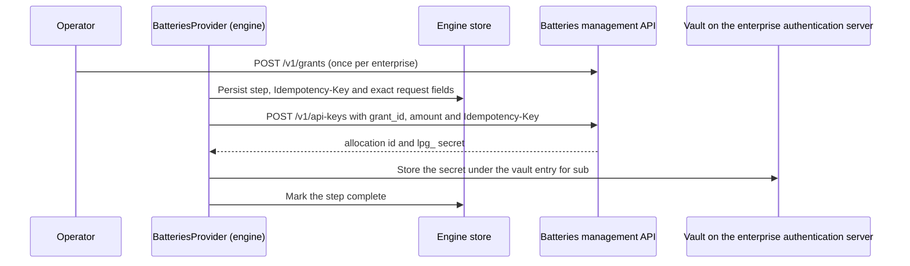

# Batteries Management Integration

**Status:** Draft for review\
**Updated:** 6 October 2026\
**Context:** [Payment provisioning modes](payment-provisioning-modes.md), [enterprise authorization server](enterprise-authorization-server.md), [Clearinghouse configuration](clearinghouse-configuration.md), [builder-layer proposal](../references/analysis/2026-10-01-Builder-Layer-Abstraction-and-Two-Application-Review.md), [cost-sync adapter](../references/analysis/2026-10-06-Batteries-Cost-Sync-Adapter-Interface.md)

The builder engine can provision payment allocations today. Clearinghouse Batteries has served a management HTTP API on `main` since 23 September, so the `PaymentProvider` adapter can be written without waiting on the maintainer.

The integration runs in two phases:

- **Phase A, single tenant.** The enterprise gateway acts as a reseller with one wholesale grant. It needs no further Batteries change.
- **Phase B, multi-tenant.** A tenant layer in the engine, closer to the PymtHouse model. It also leaves Batteries unchanged. Three upstream asks that remove Phase A workarounds were delivered on 6 October 2026. The gaps that remain are listed under [Upstream asks](#upstream-asks). None of them blocks Phase A.

No Cloud SPE decision record accepts this contract yet.

## The payment boundary

Batteries and the go-livepeer remote signer are the payment path in both payment modes. Mode A is self-operated; in Mode B a hosted operator runs Batteries and the signer, and the engine holds `lpg_` keys under a grant that operator provides. Three roles follow:

| Role | Owns | Does not own |
| --- | --- | --- |
| Enterprise app and its issuer | Users, retail prices, user balance checks before a job is submitted | Network cost, signing |
| Engine | Jobs, attempts, network-cost projection, Batteries provisioning | Retail prices, user balances |
| Batteries and the remote signer | The allowance, enforced at signing; network cost in USD | Retail prices |

- **The allowance is a hard cap at signing.** The signer calls its `-remoteSignerWebhookUrl` during `GenerateLivePayment`. Batteries answers that webhook, resolving the `lpg_` key to its allocation and refusing with 402 when `allocation_available` is zero.
- **Batteries meters network cost, not retail cost.** It debits allocations by the ticket event's `computed_fee_usd` and applies no markup.
- **Allocation and key creation are requirements.** The balance check works per key, so any per-tenant or per-user cap needs its own allocation and key, created through the management API.
- **External billing systems are adapters, not payment providers.** Kong, PymtHouse or Stripe attach through a `BillingAdapter` that consumes engine usage and cost events. It never authorizes signing.

## Evidence

Reviewed 6 October 2026 against [`livepeer/clearinghouse-batteries`](https://github.com/livepeer/clearinghouse-batteries) `main` at `501c1ed`. The management API arrived in `a2ed175` "Add management API" (23 September 2026). Service credentials arrived in `9cf68d6` "API auth (#4)" (30 September 2026). The 6 October review is source evidence: the routes and schema were read at that revision, and `go test ./...` passed. No signer, Kafka and Batteries run was executed for this update.

The maintainer closed the three asks tracked on this design the same day:

| Ask | Batteries issue | Delivered by |
| --- | --- | --- |
| Caller idempotency on create and fund | [#5](https://github.com/livepeer/clearinghouse-batteries/issues/5) | [#9](https://github.com/livepeer/clearinghouse-batteries/pull/9) `2bbcd29`, migration `002_management_idempotency.sql` |
| Allocation balance, list filters, API-key item route | [#6](https://github.com/livepeer/clearinghouse-batteries/issues/6) | [#10](https://github.com/livepeer/clearinghouse-batteries/pull/10) `66d4151`, [#11](https://github.com/livepeer/clearinghouse-batteries/pull/11) `747f1a1`, [#17](https://github.com/livepeer/clearinghouse-batteries/pull/17) `b443718` |
| Attributed usage with a cursor | [#7](https://github.com/livepeer/clearinghouse-batteries/issues/7) | [#19](https://github.com/livepeer/clearinghouse-batteries/pull/19) `430b68a`, [#20](https://github.com/livepeer/clearinghouse-batteries/pull/20) `e8842e2` |

`501c1ed` itself ([#21](https://github.com/livepeer/clearinghouse-batteries/pull/21)) only changes a Kafka test. [#19](https://github.com/livepeer/clearinghouse-batteries/pull/19) and [#20](https://github.com/livepeer/clearinghouse-batteries/pull/20) edited `migrations/001_initial.sql` in place. A database that already applied the previous `001` fails the migrator's checksum check and must be rebuilt. `002` is a new file and applies cleanly on top of the rebuilt `001`.

| Claim | Source |
| --- | --- |
| Routes, permissions and body rules | `internal/app/management.go` |
| Credential registry and permission vocabulary | `internal/serviceauth/registry.go`, `creds.example.toml` |
| Serve flags | `internal/app/server.go` `ServeParams` |
| Create, fund, revoke and key semantics | `internal/store/manage.go` |
| Ledger report shape | `internal/store/store.go` `Report` |
| Signer authorization webhook, 402 on exhaustion | `internal/auth/http.go`, `internal/store/auth.go`; go-livepeer `server/remote_signer.go` at `773734d9` |
| Allocation debit from `computed_fee_usd` | `internal/store/ingest.go` |

The 26 September discussion with the maintainer took place before this API was pushed. The [provisioning](payment-provisioning-modes.md) and [Clearinghouse configuration](clearinghouse-configuration.md) drafts are updated to this same revision.

## The management API today

`serve --enable-management-api :PORT` starts a second HTTP listener. It must use a different port from the signer webhook. It binds to loopback unless `--unsafe-http-bind` is set. `--creds-file` is required.

Every resource route checks the `Livepeer-Clearinghouse-Token` header against a `management` credential whose `allow` list names the permission. Credentials load once from a TOML or JSON file. A permission covers every resource of its type. No credential is scoped to one grant.

| Method and path | Permission | Behaviour that matters to the engine |
| --- | --- | --- |
| `POST /v1/grants` | `grants.create` (+ `grants.fund` if funded) | One grant is one customer budget. `sponsor`, `metadata`, a time window |
| `POST /v1/grants/{id}/fund` | `grants.fund` | Adds to the grant's unallocated balance |
| `POST /v1/allocations` | `allocations.create` (+ `.fund` if funded) | Requires `grant_id`. Accepts `beneficiary` and opaque `metadata`. Amount defaults to zero |
| `POST /v1/allocations/{id}/fund` | `allocations.fund` | Moves grant funds in. Raises `allocated_units`. `all` drains the grant |
| `POST /v1/allocations/{id}/revoke` | `allocations.revoke` | Returns the unused balance to the grant. Repeating it is harmless |
| `PATCH /v1/allocations/{id}/status` | `allocations.status` | `active` or `paused` only |
| `POST /v1/api-keys` | `api_keys.create`, plus `allocations.create` and `.fund` when given `grant_id` | Exactly one of `allocation_id` or `grant_id`. Returns `lpg_` once. With `grant_id`, it creates a funded allocation and the key together |
| `POST /v1/api-keys/{id}/revoke` | `api_keys.revoke` | Ends later authorizations on that key |
| `GET /v1/grants`, `/v1/allocations` (and `/{id}`) | `*.read` | Allocation rows carry `allocated_usd` or `allocated_eth`, plus `available_` and `spent_` in that same currency ([#11](https://github.com/livepeer/clearinghouse-batteries/pull/11)). Lists accept `grant_id` on allocations |
| `GET /v1/api-keys` (and `/{id}`) | `api_keys.read` | Id, allocation, name, prefix and timestamps. The item route is [#10](https://github.com/livepeer/clearinghouse-batteries/pull/10). Lists accept `grant_id` and `allocation_id` |
| `GET /v1/usage` | `usage.read` | Fees, status, `allocation_id`, `payment_session_id`, `request_id`, `pipeline` and `manifest_id`. Filters are `grant_id`, `allocation_id` and `manifest_id` |
| `GET /v1/ledger/report` | `ledger.read` | Every account balance. Phase A allowance no longer reads this report |
| `GET /v1/sessions`, `/v1/settlements`, `/v1/escrow/*` | `*.read` | Operator evidence. Session and settlement lists accept `grant_id` and `allocation_id` |

List routes return `{"items", "next_cursor"}`. `limit` defaults to 100 and may be 1 through 1,000. The cursor is opaque and bound to the resource and filters it was issued for. An empty `next_cursor` means the page is the last one; Batteries does not return a cursor to resume from after that page. Results are in insertion order. Unknown ids, and an allocation that does not belong to the given grant, return an empty page rather than 404. Usage and settlements that have no payment session appear only in an unfiltered list, so a `manifest_id` filter misses rows quarantined for having no session.

Allocation creation, API-key creation, grant funding and allocation funding accept an optional `Idempotency-Key` header. Grant creation, revoke and status changes do not.

Bodies are flat string fields in JSON or form encoding, at most 1 MiB, and unknown fields are refused. Errors are JSON `{"error"}` with status 400, 404, 409, 413 or 415. `409` covers a state conflict, a balance conflict, or an idempotency key reused with a different operation, target or body. Failed authentication is plain text 401 or 403.

## Phase A: single-tenant reseller

The enterprise gateway is the only customer of one Batteries deployment. That deployment may be self-operated or run by a hosted operator.

- The operator creates **one grant per enterprise** once, with the CLI or `POST /v1/grants`.
- The engine's `BatteriesProvider` creates allocations under that grant, mints keys, funds and revokes. Allocations may be split per environment (CI, production) or per end user.
- End users never appear in Batteries.



### Least-privilege credential

The engine holds one `management` credential with no grant permissions:

```toml
[[credentials]]
id = "builder-engine"
secret = ""  # mounted from the deployment's secret store
[credentials.management]
allow = ["allocations.create", "allocations.fund", "allocations.read", "allocations.revoke",
         "api_keys.create", "api_keys.read", "api_keys.revoke", "usage.read"]
```

The engine therefore cannot create, fund or close grants; creating and funding grants stays an operator action. Phase A allowance comes from the allocation read, so the credential no longer needs `ledger.read`. The credential stays server-side in both integration modes. It is not the signer's `webhook` credential and never reaches a caller.

### Retry safety

[#9](https://github.com/livepeer/clearinghouse-batteries/pull/9) adds an optional `Idempotency-Key` on allocation creation, API-key creation, grant funding and allocation funding. A matching retry returns the original success, including the API-key secret. Errors are not saved, so a retry after an error runs the write again. That is safe: a failed write rolls back. Saved successes do not expire. A retry after revocation still returns the original response and does not restore access or move funds a second time. The engine must not treat a replayed success as proof the key is still active.

The engine persists the step name, the key and the exact request fields before the call, then retries with that same key and those same fields. A `409` means the key was reused with a different operation, target or body. The engine stops that step for investigation and does not mint a replacement key for it. Field order does not matter. Adding an empty or default field does: Batteries compares decoded values, so `"1"` and `"1.0"` differ.

Keys are shared by every caller of the grant, across these four operations. The engine namespaces its own as `base64url(sha256(engine_id:operation_ref:step))`. That is 43 characters, inside the 256-character limit. The alphabet is base64url (`A-Z`, `a-z`, `0-9`, `_`, `-`, `=`). A different grant may reuse the same key. Invalid keys return `400`.

Because a lost response can be replayed, the atomic `POST /v1/api-keys` path with `grant_id` is usable again. One call creates the allocation, the key and the funding. Split steps remain for an allocation the engine funds later. Each step gets its own key. Revoke still takes no key and is safe to repeat.

Batteries stores the saved API-key response, including the plaintext secret, in `management_idempotency`, and therefore in database backups. Its [SECURITY.md](https://github.com/livepeer/clearinghouse-batteries/blob/501c1edbbee1a43c06ccfcafb404f185e3580a6c/SECURITY.md) says any management credential that can create keys can retrieve that secret by repeating the key and the request. The engine still copies the secret into the vault on the first success. Batteries backups need the same protection as the vault.

An operator who funds with a different idempotency key still moves money. Revocation remains the remedy for an over-fund: it returns the unused balance to the grant and ends sessions bound to that allocation's keys.

### Balance, usage and cost

| Need | Phase A source | Limit |
| --- | --- | --- |
| `PaymentProvider.allowance` | `GET /v1/allocations/{id}` `available_usd` or `available_eth`, and the matching `spent_` field ([#11](https://github.com/livepeer/clearinghouse-batteries/pull/11)) | The suffix follows `currency`. Granted amount is `allocated_usd` or `allocated_eth` on the same object. The ledger report is no longer filtered client-side |
| Per-job network cost | `GET /v1/usage`, copied by the [cost-sync adapter](../references/analysis/2026-10-06-Batteries-Cost-Sync-Adapter-Interface.md) | Rows carry `allocation_id` and `manifest_id`. Querying and selection stay in the engine's Postgres store. The [export topic](usage-event-export.md) remains an optional push path |
| Allocation spend | The same allocation read, `spent_usd` or `spent_eth` | Aggregate for the allocation, not per job |
| Prepaid session starts refused on capacity | None today | The signer reports no per-attempt payment event, so a failed prepaid start is invisible to the engine. Asked of go-livepeer; until then the attempt is `payment_sent` and its cost `pending` |

Only usage rows with status `applied` count as observed cost. `quarantined`, `ignored` and `duplicate` rows are stored and stay out of the total. A cost that has not arrived is `pending`. The adapter's rules for the cursor, including the empty `next_cursor` at the end of the list, are in the interface spec.

## Upstream asks

Delivered on 6 October 2026 at Batteries `501c1ed`. Each one removes a workaround above. None was a Phase A blocker.

1. **Caller idempotency.** Delivered by [#9](https://github.com/livepeer/clearinghouse-batteries/pull/9) for allocation and API-key creation and for grant and allocation funding. Grant creation is not covered and stays an operator action. Disposition recorded on `netspe-scr.12`.
2. **Narrow reads.** Delivered by [#10](https://github.com/livepeer/clearinghouse-batteries/pull/10), [#11](https://github.com/livepeer/clearinghouse-batteries/pull/11) and [#17](https://github.com/livepeer/clearinghouse-batteries/pull/17): `available_` and `spent_` amounts on allocation reads, `grant_id` and `allocation_id` list filters, and `GET /v1/api-keys/{id}`. Disposition recorded on `netspe-scr.13`.
3. **Attributed usage with a cursor.** Delivered by [#19](https://github.com/livepeer/clearinghouse-batteries/pull/19) and [#20](https://github.com/livepeer/clearinghouse-batteries/pull/20). The cursor is an opaque string bound to its filters, not an integer `after`. Usage items include allocation, payment session, request, pipeline and `manifest_id`. This is the pull path the [proposal](../references/analysis/2026-10-01-Builder-Layer-Abstraction-and-Two-Application-Review.md#upstream-interfaces-the-layer-wraps) assumed from `/v1/cost/events`. The export topic remains an optional push path. Disposition recorded on `netspe-scr.14`.

Three gaps in that pull path are not blocking. Each could be a later maintainer request:

- Batteries omits `next_cursor` on the last page, so a poller keeps the cursor that fetched that page and drops rows it has already stored, keyed by usage `id`.
- There is no `status` filter. The list includes `quarantined`, `ignored` and `duplicate` rows.
- Usage items omit `billable_seconds`, `pixels`, start and end times, and ticket count, although those columns are stored.

A management credential is still global. A read scoped to one grant or one caller remains open for hosted-operator mode and is an access-contract question, not a cost-sync question. The signer's ticket events are still best-effort: go-livepeer sends them asynchronously and can drop them when the Kafka queue is full.

## Phase B: multi-tenant

Phase B serves several enterprises (tenants) from one engine and one Batteries deployment. The recommended first step adds tenants in the engine and leaves Batteries unchanged. The shape follows PymtHouse, which separates the tenant application, its machine credential, its end users, and the credit granted to them.

| Concept | PymtHouse / clearinghouse-oss | Engine (Phase B) | Batteries |
| --- | --- | --- | --- |
| Tenant | App (`app_` public client) | `tenant_id` on every engine record | One grant, `sponsor` and `metadata` carry `tenant_id` |
| Tenant administrator | `m2m_` client, HTTP Basic | Tenant admin credential issued by the engine (`client_secret_basic`) | None. The engine holds the only management credential |
| End user | App user (`external_user_id`) | Opaque `actor_id` within the tenant | None, or one allocation per user when chosen |
| Credit | Signer credit grant (`amountWei`) | Fund command scoped to the tenant's grant | Allocation fund |
| Usage | Signer usage events with `manifest_id` | Event feed filtered by tenant | Ledger and export events, `subject` = `enterprise_id` |

The engine enforces isolation: every management call resolves the caller's tenant, checks that the target grant or allocation carries that `tenant_id`, then calls Batteries with the engine credential. A tenant cannot name another tenant's grant or allocation, even if it knows the id.

Per-user or per-device allocations are optional in Phase B. They are needed only where a credential leaves the gateway, as in [local gateway mode](enterprise-auth-provider-modes.md#local-gateway-without-the-server-mode-9). A leaked key is then bounded by its own allocation.

Later upstream options, each a separate maintainer decision:

- **Grant-scoped management credentials** issued at run time, so a tenant could call Batteries directly. Today credentials are global and static.
- **Per-grant JWKS signer authorization**, so a short-lived JWT replaces the `lpg_` bearer. The maintainer was hesitant on 26 September. The engine does not assume it: the payment credential stays an `lpg_` key.

Prior art for the tenant layer: the `pymthouse/clearinghouse-oss` admin API at `9c88b3b` (apps, app users, grants under HTTP Basic), and the tenant-admin routes that `livepeer/clearinghouse` #88 added and #92 removed.

## Decisions

- `BatteriesProvider` targets the management HTTP API on Batteries `main`. Operator CLI seeding remains a fallback, not a prerequisite.
- Phase A is one grant per enterprise, created by the operator, with engine-managed allocations and keys under it.
- The engine credential is least-privilege and has no grant permissions.
- Provisioning retries use grant-scoped idempotency keys. The engine namespaces each key and resends identical fields. A `409` stops the step. The atomic `grant_id` key path is the Phase A default.
- Job cost is pulled from `GET /v1/usage` through the cost-sync adapter and joined on `(allocation_id, manifest_id)`. The export topic is an optional push path. Querying and selection stay in the engine's Postgres store.
- Multi-tenancy starts as an engine-side tenant layer over unchanged Batteries.
- Batteries and the remote signer are the only payment path. Retail prices and user balances stay with the enterprise app; external billing systems attach as `BillingAdapter` sinks.
- Job cost uses the proposal's four statuses. Missing cost is `pending`; there is no `unavailable` status.

## Work this design implies

`netspe-cz5.16` is the Phase A `BatteriesProvider` client. It now sends idempotency keys and reads allowance from the allocation object. `netspe-cz5.6` seeds the vault from it. `netspe-scr.12`, `netspe-scr.13` and `netspe-scr.14` record the maintainer dispositions and are closed. `netspe-scr.29` is this update and the cost-sync interface. `netspe-scr.15` is the Phase B tenant layer. `netspe-cz5.11` is the optional export topic. `netspe-scr.25` is the go-livepeer ask for a per-attempt payment event, and `netspe-scr.26` is the `BillingAdapter` sink. `netspe-scr.8` is the engine's own job idempotency and is unchanged by Batteries #9.
