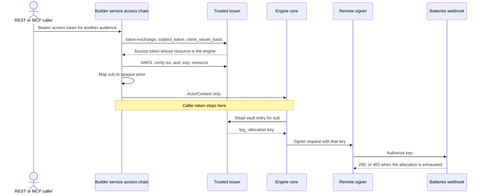
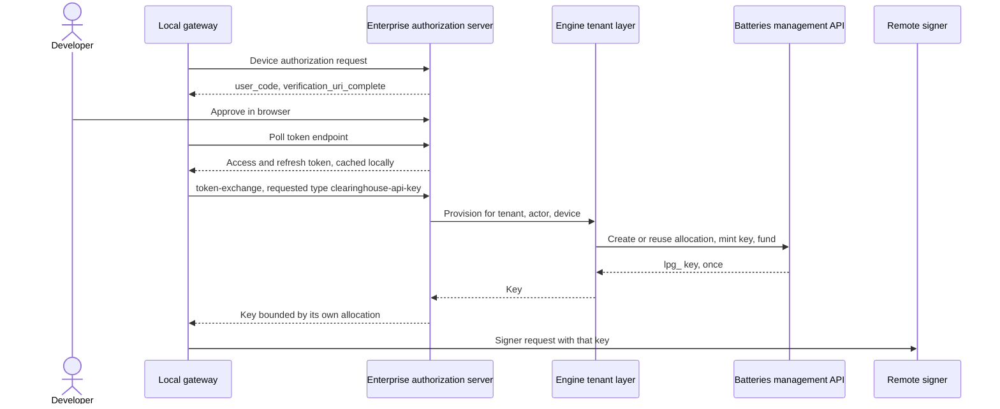

# Enterprise Authentication Provider Modes

**Status:** Draft for review\
**Updated:** 1 October 2026\
**Context:** [Enterprise authorization server](enterprise-authorization-server.md), [MCP tooling](mcp-tooling.md), [Batteries management integration](batteries-management-integration.md), [builder-layer proposal](../references/analysis/2026-10-01-Builder-Layer-Abstraction-and-Two-Application-Review.md#classes-and-interfaces)

The builder service, `livepeer_builder_service`, accepts nine authentication modes through one ordered provider chain. The chain sits above the engine core: every mode produces the same `ActorContext`, and the core receives nothing else. An application that imports the engine brings its own authentication and passes the actor in.

The payment credential resolves in a separate step, so a payment secret never rides on the actor. It is always a Clearinghouse Batteries `lpg_` allocation key: the remote signer authorizes through Batteries in both payment modes, and Batteries refuses a key whose allocation is exhausted. Retail prices and user balance checks stay with the enterprise app and its issuer.

The public MCP OAuth and user-scoped vault sequence in the [authorization draft](enterprise-authorization-server.md) is mode 5. This draft adds the other modes an enterprise app needs:

- HTTP Basic, both for end users and for confidential clients;
- OIDC bearer tokens;
- default MCP clients through CIMD (OAuth Client ID Metadata Documents);
- device authorization;
- audience token exchange behind the REST or MCP server;
- a local gateway that runs without the server.

No Cloud SPE decision record accepts this contract yet. The ISS-02 review response recommends the boundary above; the access chain itself is ISS-03.

## Evidence

Reviewed 1 October 2026. These are reference implementations, not dependencies of the engine.

| Source | Revision | What it shows |
| --- | --- | --- |
| [`livepeer/console`](https://github.com/livepeer/console) | `009a703` (pinned baseline) | PKCE public-client authorization server (`lib/mcp/as.ts`), RFC 9728/8414 metadata (`lib/mcp/oauth.ts`), stateless DCR (`app/register/route.ts`), CIMD allowlist (`lib/mcp/cimd.ts`), confidential token exchange (`lib/console/mcp-internal-mint.ts`), device approval as a relying party only |
| [`pymthouse/pymthouse`](https://github.com/pymthouse/pymthouse) | `main` `f39ccf15` | Full authorization server: device flow, client credentials, an app-scoped token exchange that public clients can call, and five other exchange variants (`src/app/api/v1/oidc/[...oidc]/route.ts`) |
| [pymthouse#558](https://github.com/pymthouse/pymthouse/pull/558) | head `4dc0846a` | Protected-resource and authorization-server metadata, DCR, CIMD, and a catalog of default MCP clients (`src/lib/mcp/catalog.ts`), with access-token `aud` set to the MCP URL |
| `pymthouse/livepeer-gateway-client` | `feat/clearinghouse-mint-auth0` `5d09b3e` | Local gateway: discovery, device login, token cache and refresh (`livepeer_gateway_client/oidc_auth.py`), and a strategy-based signer credential provider (`signer_provider.py`) |

## Provider chain

The [proposal's](../references/analysis/2026-10-01-Builder-Layer-Abstraction-and-Two-Application-Review.md#the-extension-protocols) single `Authenticator` protocol is split into four steps. The first three run in `livepeer_builder_service`; the engine core only ever sees their result. Each step can be replaced on its own.

```python
class CredentialExtractor(Protocol):        # bearer header, Basic header, session cookie
    def extract(self, request: InboundRequest) -> Credentials | None: ...

class Verifier(Protocol):                   # opaque key, password, client secret, JWT via JWKS
    async def verify(self, credentials: Credentials) -> VerifiedSubject: ...

class ActorMapper(Protocol):                # sub + issuer -> opaque actor, application, scopes
    async def map(self, subject: VerifiedSubject) -> ActorContext: ...

class PaymentCredentialResolver(Protocol):  # Batteries lpg_ key: vault, or a caller-supplied key
    async def resolve(self, actor: ActorContext, request: JobRequest) -> PaymentCredentialRef: ...
```

Four rules govern the chain:

1. **Ordered chain.** Providers run in configuration order. The first extractor that recognizes a credential owns it. If that credential then fails verification, the request returns 401. It does not fall through to the next provider.
2. **One challenge.** A 401 challenge lists every enabled scheme: `Bearer` with `resource_metadata` when an OAuth mode is on, and `Basic realm` when a Basic mode is on.
3. **No payment secrets on the actor.** `PaymentCredentialRef` is a handle the transport resolves at call time. It is never copied into `ActorContext.attributes`, job records or events, which addresses the [proposal assessment](../references/analysis/2026-10-01-Builder-Layer-Proposal-Assessment.md#trusted-access-administration-and-payment-credentials).
4. **Same result for every mode.** The actor context is identical whichever mode produced it, so routes, MCP tools and the job service cannot tell the modes apart.

Configuration sketch for the service package:

```yaml
auth:
  providers:
    - kind: api_key                      # mode 1
    - kind: oidc_bearer                  # modes 4-9 end here
      trusted_issuers:                   # one or more; each verified against its JWKS
        - https://auth.example.com
      audience: https://engine.example.com/api/mcp
    - kind: http_basic_user              # mode 2
      verifier: enterprise_app.auth:verify_basic
  mcp:
    authorization_server: https://auth.example.com
    cimd_allowlist: default              # mode 6
    default_clients: [claude, codex, chatgpt, cursor, hermes]
  payment_credential:
    kind: vault                          # vault | passthrough (a caller's lpg_ key)
```

## Mode catalog

| # | Mode | Caller | Standard | Where the caller credential stops | Payment credential | Reference |
| --- | --- | --- | --- | --- | --- | --- |
| 1 | Operator API key | REST or MCP client, standalone | Bearer | Builder service | Server configuration | `netspe-cz5.4` |
| 2 | HTTP Basic, end user | User-facing routes | RFC 7617 | Builder service, through an enterprise-supplied verifier | Vault or pass-through | pymthouse `authenticateAppClient` (shape only) |
| 3 | `client_secret_basic`, confidential client | Enterprise backend, REST or MCP server | RFC 6749 §2.3.1 | Authorization server token endpoint | Not a payment credential | Console `lib/console/pymthouse-http.ts` |
| 4 | OIDC bearer, resource server | Any client holding an access token | RFC 9068, JWKS | Builder service | Vault | `netspe-cz5.3` |
| 5 | MCP public client, PKCE | MCP harness | RFC 7636, 9728, 8414, 8707 | Builder service | Vault | [Authorization draft](enterprise-authorization-server.md) |
| 6 | CIMD plus default client catalog | MCP harness with no registration step | CIMD draft, RFC 7591 optional | Builder service | Vault | Console `lib/mcp/cimd.ts`, pymthouse#558 `catalog.ts` |
| 7 | Device authorization | CLI, headless agent | RFC 8628 | Builder service, or the local gateway | Vault | `oidc_auth.py` `device_login` |
| 8 | Audience token exchange behind the server | Builder service or enterprise backend | RFC 8693 | Builder service. Only the exchanged token continues onward | Vault | Console `mcp-internal-mint.ts` (shape only) |
| 9 | Local gateway, no server | Developer machine | 7 + 8 | Local gateway | Per-device allocation key | `signer_provider.py` |

## Server-side credentials: modes 1 to 4

**Mode 1** is the standalone baseline. The builder service issues the key, stores its hash and maps it to an actor.

**Mode 2** accepts `Authorization: Basic` on user routes. The builder service never stores user passwords. The enterprise supplies a `Verifier` for either:

- `key_id:secret`, a pair the engine issued, checked against its hash; or
- `username:password`, checked by the enterprise's own user store.

A failed check returns 401 with `WWW-Authenticate: Basic realm="…"`. Basic is accepted only over TLS. Rate limits apply per username and per source address.

**Mode 3** is outbound only. Whenever the builder service or enterprise backend calls a token endpoint (mode 8, or client credentials), it authenticates as a confidential client with HTTP Basic. The client secret lives in the deployment's secret store. Mode 3 never authenticates an inbound caller.

**Mode 4** verifies a JWT access token:

- `iss` against the configured trusted issuers, then `aud`, `exp` and `nbf` against that issuer's JWKS;
- the `resource` the token was minted for (RFC 8707), required to equal this engine's API or MCP resource.

Console accepts tokens whose audience is the PymtHouse issuer. PR #558 instead binds `aud` to the MCP URL. The engine follows #558: a token minted for another resource is refused, so a token stolen from one service cannot be replayed against the engine.

## MCP public clients: modes 5 and 6

Mode 5 is unchanged from the [authorization draft](enterprise-authorization-server.md#protocol).

Mode 6 removes the registration step for known harnesses. The authorization server advertises `client_id_metadata_document_supported: true` and accepts two kinds of `client_id`:

- **An HTTPS CIMD URL on the allowlist.** The server fetches the document and checks that its `client_id` equals the URL and that its token endpoint auth method is `none`. Fetch guards copied from Console: HTTPS only, no credentials, port, query or fragment in the URL, 3 s timeout, 16 KB limit, 60 s cache, no redirects.
- **A default catalog client id.** A pre-registered public client. Configuration chooses which catalog entries are enabled.

| Catalog entry | `client_id` | Redirect URIs | Grants |
| --- | --- | --- | --- |
| Claude | `mcp_claude`, or the Claude CIMD URL | `https://claude.ai/api/mcp/auth_callback`, `https://claude.com/api/mcp/auth_callback`, loopback | `authorization_code`, `refresh_token` |
| Codex | `mcp_codex`, or the ChatGPT Codex CIMD URL | loopback | same |
| ChatGPT | `mcp_chatgpt`, or a ChatGPT CIMD URL | `https://chatgpt.com/connector_platform_oauth_redirect`, loopback | same |
| Cursor | `mcp_cursor` (static, for `mcp.json`) | `cursor://anysphere.cursor-mcp/oauth/callback`, `https://cursor.com/agents/mcp/oauth/callback`, loopback | same |
| Hermes | `mcp_hermes`, or the Hermes CIMD URL | loopback | same |

All catalog entries use token endpoint auth method `none`, PKCE `S256`, and scopes `openid profile email offline_access` plus the engine's job scope.

- **Loopback redirects** follow RFC 8252: any port on `127.0.0.1`, `localhost` or `[::1]` with the registered path.
- **Refresh tokens** are issued only when `offline_access` is granted.
- **DCR** (RFC 7591) is optional and off by default. Catalog and CIMD cover the pinned clients without storing a registration for each user.

## Device authorization: mode 7

The builder service, or a local gateway, reads `device_authorization_endpoint` from the configured issuer's discovery document:

1. It requests a device code with the engine resource indicator and the job scope.
2. It shows `verification_uri_complete` to the user.
3. It polls at the server's interval.
4. `access_denied` and `expired_token` end the flow. `slow_down` raises the interval.
5. Tokens are cached per issuer, client and scope, and refreshed before expiry.

The device client is a pre-registered public client with grants `urn:ietf:params:oauth:grant-type:device_code` and `refresh_token`, as in the `auth0-livepeer` tenant's native client. The defaults in `oidc_auth.py` (`livepeer-sdk`, `openid profile gateway`) do not work against PymtHouse. PymtHouse requires an `app_` client with the device grant enabled and the `sign:job` scope. Each deployment therefore configures its own client id and scope. The engine sets no default.

## Token exchange behind the server: mode 8

Mode 8 is an audience exchange, run by an audience-exchange step in the builder service's `Verifier`. The enterprise's identity provider issued the user's token for another audience. The builder service exchanges it at a trusted issuer for a token whose resource is the engine, authenticating with mode 3, then verifies that token as in mode 4.

There is no payment exchange. A hosted operator's signer JWT, as PymtHouse issues, is outside the payment boundary: the signer authorizes through Batteries, so the payment credential is always an `lpg_` key from the vault.



Clearinghouse Batteries authorizes only `lpg_` bearer keys; it has no JWT verification. The payment credential therefore comes from the vault, never from an exchange.

## Local gateway without the server: mode 9

A developer runs the gateway on their own machine with no engine server running. The gateway authenticates with mode 7, caches the token, then needs a payment credential of its own.

The difficulty is that the payment credential has to leave the server's trust boundary. The signer accepts only an `lpg_` key, and the [authorization draft](enterprise-authorization-server.md#user-scoped-vault) keeps the wholesale key away from clients. A local gateway must not receive the enterprise's wholesale key.

This draft recommends a **per-device allocation key**:

1. The local gateway exchanges its device-flow token at the enterprise authorization server, with `requested_token_type=urn:livepeer:token-type:clearinghouse-api-key`.
2. The server calls the engine's tenant layer, which provisions or reuses an allocation for that user and device ([Batteries Phase B](batteries-management-integration.md#phase-b-multi-tenant)).
3. The server mints a key on that allocation and returns it once.
4. The leaked-key exposure is bounded by that allocation's balance. Revoking the allocation or key ends it.

The alternative, per-grant JWKS verification inside Batteries, would allow short-lived JWTs, but it is a maintainer decision that is not scheduled. Until Phase B exists, local gateway mode with Batteries is limited to operators who hold their own allocation key.



## Review notes on pymthouse#558

These notes go to the PR author. They do not affect the engine design.

1. **TTL regression.** The PR branches from `6f220844`, before #488 made OIDC TTLs environment-driven. `src/lib/oidc/provider.ts` on the branch hardcodes 1-hour access, 30-day refresh and 14-day session and grant TTLs. A straight merge reverts #488 or conflicts with it.
2. **Binding TTL.** `src/lib/oidc/mcp-app-grant.ts` and `consent-grant.ts` hardcode 14 days. Once grant TTLs follow #488's 90-day default, the app binding can expire before the grant. Refreshed tokens would then lack `pymthouse_app` and be refused.
3. **Two CIMD paths.** CIMD is handled both by the provider's native feature and by a `Client.find` patch (`cimd-materialize.ts`). One path is easier to reason about.
4. **Matching by client name.** `catalogClientFromName` treats any dynamically registered client whose `client_name` contains "claude", "cursor" and so on as that catalog client. Matching should rely on the static id, CIMD URL or redirect URI, not on a name the registrant chooses.

## Decisions

- Authentication is an ordered chain of extractor, verifier and actor mapper in `livepeer_builder_service`, above the engine core, with configurable trusted issuers. The core receives only `ActorContext`.
- Payment credentials resolve separately and never ride on the actor. The credential is always a Batteries `lpg_` key; there is no payment exchange.
- HTTP Basic is supported both for end users (mode 2) and for confidential clients calling token endpoints (mode 3).
- Access tokens must name the engine as their resource. Tokens issued for another audience are exchanged first at a trusted issuer (mode 8), not accepted as they are.
- MCP clients register by CIMD URL or default catalog id. DCR is optional.
- Device authorization is an optional provider module, not part of core identity.
- A credential that leaves the server is a per-device allocation key, never the wholesale key.
- Retail prices and user balance checks stay with the enterprise app and its issuer. Batteries enforces the allowance at signing.

## Work this design implies

`netspe-cz5.4` (mode 1), `netspe-cz5.3` (mode 4) and `netspe-cz5.2` (mode 5) already exist. The remaining modes:

- `netspe-scr.16`: mode 2, HTTP Basic for end users.
- `netspe-scr.17`: mode 3, `client_secret_basic`.
- `netspe-scr.18`: mode 6, CIMD and the default catalog.
- `netspe-scr.19`: mode 7, device authorization.
- `netspe-scr.20`: mode 8, audience token exchange.
- `netspe-scr.21`: mode 9, local gateway. Depends on `netspe-scr.15`, `.19` and `.20`.

`netspe-scr.22` carries the PR #558 review notes.
