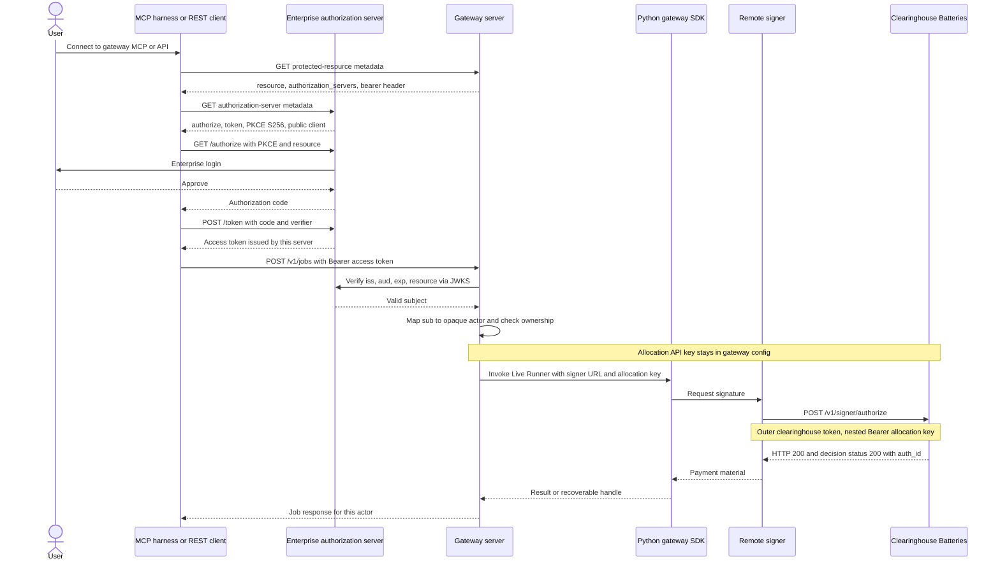

# Enterprise Authorization Server

**Status:** Draft for review
**Updated:** 25 September 2026
**Context:** [Gateway server routes](gateway-server-routes.md), [MCP tooling](mcp-tooling.md), [provisioning modes](payment-provisioning-modes.md)

The gateway is an OAuth 2.0 protected resource. The enterprise application supplies the authorization server. Clearinghouse Batteries is not that server. It authenticates the remote signer and the allocation API key only.

No Cloud SPE decision record accepts this contract yet. The access profile in the [primary proposal](self-sovereign-open-builder-stack-draft.md) is still unresolved; this draft is the recommendation for review.

## Three credentials

| Credential | Who presents it | Who checks it |
| --- | --- | --- |
| Caller credential | REST or MCP client | Gateway access adapter |
| Allocation API key | Gateway, inside the signer request | Clearinghouse, nested `Authorization: Bearer` on the webhook body |
| Clearinghouse webhook token | Remote signer, header `Livepeer-Clearinghouse-Token` | Clearinghouse webhook |

The caller credential is an operator-issued gateway API key in standalone mode, or an access token from the enterprise authorization server in enterprise mode. The adapter turns either credential into one internal context: an opaque actor id, an owner scope, and the allowed operations. Enterprise login, SSO, and admission policy stay in the enterprise. The engine stores the opaque actor and ownership checks.

Customer access tokens end at the gateway. They are not forwarded to the signer or to Clearinghouse. The allocation key and the webhook token are deployment secrets.

## Protocol

Enterprise mode follows the shape already implemented by Console's MCP metadata, with a local issuer:

- [RFC 9728](https://www.rfc-editor.org/rfc/rfc9728) protected-resource metadata on the gateway, including `resource`, `authorization_servers`, and `bearer_methods_supported: ["header"]`.
- [RFC 8414](https://www.rfc-editor.org/rfc/rfc8414) authorization-server metadata on the enterprise server: authorization endpoint, token endpoint, `code` response type, `S256` [PKCE](https://www.rfc-editor.org/rfc/rfc7636), and public clients (`token_endpoint_auth_methods_supported: ["none"]`).
- [RFC 8707](https://www.rfc-editor.org/rfc/rfc8707) resource indicator equal to the gateway MCP or API resource.
- Access tokens whose `iss` is the enterprise authorization server. The gateway verifies issuer, audience, expiry, and resource against that server's JWKS, then maps `sub` to the opaque actor.

Console at the pinned revision publishes this metadata and PKCE flow, then mints the access token through PymtHouse and verifies PymtHouse's JWKS (`lib/console/mcp-internal-mint.ts`, `lib/mcp/jwt.ts`). The reference authorization server publishes its own issuer and JWKS. The signer-session token exchange to PymtHouse is absent, because the gateway already holds the allocation key.

Device authorization is optional example behavior. It is not part of the core server.

## Sequence

Standalone mode skips the authorization server. The client presents the operator-issued gateway API key. The gateway still builds the actor context before calling the SDK. The signer webhook sequence is unchanged.

A normal Clearinghouse decision is HTTP 200 with a JSON `status` of 200, 401, 402, or 403. The gateway treats a non-200 decision status as a payment failure even when the HTTP status is 200.

## Allocations and actors

Each enterprise uses one wholesale Clearinghouse allocation. Clearinghouse stores no end-user records, and the opaque actor never reaches it. An end-user allowance is an entitlement in the enterprise store. The gateway checks that entitlement before it calls the SDK and enforces per-user limits while metered work runs. Clearinghouse enforces only the enterprise's wholesale budget on the shared allocation key. Creating a Clearinghouse allocation per end user is a later contract choice. A grant remains a budget, not a user record. Details are in the [provisioning draft](payment-provisioning-modes.md#wholesale-accounting-model).

## Decisions

- The authorization server is pluggable and enterprise-owned. Clearinghouse stays on the webhook and the allocation key.
- The gateway verifies a local issuer. PymtHouse is not required for token mint or JWKS.
- Standalone and enterprise modes share one actor context and one invocation path.
- Payment granularity is one wholesale allocation per enterprise. Per-user limits belong to the gateway and the enterprise.

## Work this design implies

A later roadmap bead should separate the protected-resource metadata, the JWKS verification adapter, the standalone API-key adapter, and the removal of the PymtHouse token exchange from the reference server. Acceptance is a pinned MCP client completing PKCE against a local issuer and invoking one Live Runner job whose signer request carries only the allocation key.
