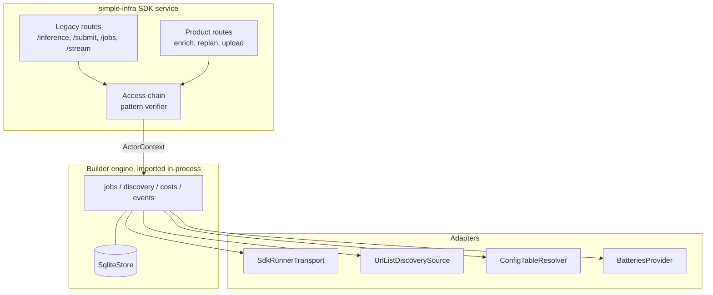

# simple-infra Migration to the Builder Engine

**Status:** Draft for review\
**Updated:** 1 October 2026\
**Context:** [Builder-layer proposal](../references/analysis/2026-10-01-Builder-Layer-Abstraction-and-Two-Application-Review.md), [proposal assessment](../references/analysis/2026-10-01-Builder-Layer-Proposal-Assessment.md), [enterprise authentication modes](enterprise-auth-provider-modes.md), [Batteries management integration](batteries-management-integration.md)

The SDK service in `livepeer/simple-infra` is the "second application" in the builder-layer proposal. Every proposed engine protocol has a working counterpart in it, except usage metering and per-job cost.

That makes it the test case for the design. If the service can move onto the engine one seam at a time, with its golden suites unchanged, the protocols are sufficient. Where it cannot, the engine contract has a gap.

This draft maps each seam and orders the migration into six phases. It also records five corrections to the proposal's description of the application.

The migration covers the Live Runner path only. Requests the service dispatches outside Live Runner are not migrated, and the engine does not support them.

No Cloud SPE decision record accepts this plan. `livepeer/simple-infra` is an Inc repository. The engine reuses no simple-infra source. This draft shows Inc how simple-infra would adopt the engine. It cites files and functions only, and copies no source, secrets or host details. A draft goes to Inc (Qiang) once prepared.

## Evidence register

Reviewed 1 October 2026 against `livepeer/simple-infra` `main` at `4ec364f`.

The service is a single-worker FastAPI application in `sdk-service-build/app.py`, with helper modules beside it. It builds on a pinned `livepeer-python-gateway` revision and is deployed by the `agent-infra` Pulumi project. MCP clients reach it through a separate MCP server outside this repository; the service has no MCP adapter of its own.

| Proposal claim (second application) | Verdict | Evidence |
| --- | --- | --- |
| A REST service over the Python gateway SDK for MCP, web and CLI clients | Confirmed | `sdk-service-build/app.py`, `sdk-service-build/README.md` |
| AI capabilities go to Live Runner apps through `call_runner` | Confirmed | `_dispatch_lr_v2` |
| Training jobs run outside Live Runner | **Corrected:** training runs as Live Runner offerings through `/inference`. `/train` targets an unset orchestrator | Offering table; `/train` handler |
| Each caller's own bearer key is forwarded to a hosted signer | Confirmed. The bearer is classified by pattern only; no validate call remains | `_effective_signer`, `key_routing.classify_key` |
| State is in memory, with finished async jobs mirrored to durable storage | Confirmed. **Corrected:** the mirror is a host-volume file store, not object storage | `_INFERENCE_JOBS`, `_DETACHED_JOBS`, `_job_store_persist_terminal` |
| An idempotency key joins the running job for 15 minutes | Confirmed: 900 s for `/inference`, 1,800 s for `/inference/submit`. A pre-dispatch decline is not replayed | `_dedupe_inference`, `_idem_existing` (#263–#265) |
| Global and per-capability admission caps answer 503 before dispatch | **Corrected:** the global cap does not bound Live Runner dispatch; it applies only after the Live Runner attempt. The per-capability limiter waits up to 240 s, fails as 502, and is not configured in production | `provider_concurrency.py`; `_inference_impl` |
| A configuration table maps capability → app, path and allowed orchestrators | Confirmed: the Live Runner offering table | `lr_offerings.py`; rendered into the service environment by `agent-infra/__main__.py` |
| Discovery reads orchestrator `/discovery` URLs plus a remote registry, on every request | **Corrected:** the URL list is live and read on every request. The registry client exists but is off | `_discover_lr_orchs`; `lr_registry_config.py` |
| Long jobs send one-second SSE heartbeats | Confirmed | `POST /inference/stream` |

Two defects found during review are handed to Inc. They are not engine work. Each fix must ship as a simple-infra pull request under that repository's rules:

- **Pinned requests fail.** A request that pins an orchestrator for a capability with a Live Runner offering raises `NameError` and returns 500. `_urlparse` is imported only inside `_orch_override_ok`, but is used in `_inference_impl`. The golden routing fixtures record the 500.
- **Job-store setting not written by Pulumi.** Production runs with the durable file job store enabled, but the `agent-infra` template never writes that setting into the service environment. A re-rendered environment would silently turn the store off.

## Seam map

Every row is an existing module, its engine protocol, and what the engine must add for this application to fit.

| simple-infra today | Engine protocol | Adapter to build | Engine change this exposes |
| --- | --- | --- | --- |
| `key_routing.classify_key`, `signer_decision` | `CredentialExtractor` + `Verifier` | Pattern verifier in the facade: composite keys accepted, retired keys refused with guidance | None. Authentication runs above the engine core (here, in the facade), which passes an `ActorContext`; see the [provider chain](enterprise-auth-provider-modes.md#provider-chain) |
| `_effective_signer` | `PaymentCredentialResolver` | Vault resolver for a Batteries allocation key. Today's PymtHouse composite-key forwarding stays in the facade, outside the engine | Proposal gap 1: the payer is chosen per request, not per application |
| `_discover_lr_orchs` over a URL list | `DiscoverySource` | `UrlListDiscoverySource`, polled in the background rather than on every request | A URL-list source; polling also removes the request-path fetch |
| Live Runner offering table | App resolver | `ConfigTableResolver` | Proposal gap 3: resolution must be a protocol with descriptor and configuration-table implementations, plus `allowed_orchestrators` |
| `lr_select.pick_bases`, `provider_selection.MeritSelector` | `SelectionPolicy` | `AllowListMeritPolicy` | A configurable maximum pool size, ranking inputs (latency, price), and a capacity-versus-other distinction. The SDK's `RunnerSelectionCursor` already fails over sequentially across the runners from the first orchestrator batch that returns any, but has none of these and does not record whether a failed attempt paid |
| `_dispatch_lr_v2` → `call_runner` | `RunnerTransport` | `SdkRunnerTransport` | A capacity refusal moves to the next candidate rather than ending the job, even after a session prepay. Each prepaid attempt is recorded `payment_sent` |
| In-memory job and idempotency maps, file job store | `EngineStore` | `SqliteStore` | Non-terminal jobs become durable |
| Pass-through `data.usage` from Live Runner apps | `UsageMeter` | A capability pack: token meter | A declarative meter from the descriptor's `quantity_source` is a candidate (see below) |
| None | `CostService` | — | None. With Batteries as the only payment path, the proposal's four cost statuses suffice; gap 2's `unavailable` is not adopted |
| Global semaphore; per-capability limiter | Engine admission | Engine-level limits | Proposal gap 6: limits must bound Live Runner dispatch and answer 503 before it |

The capability descriptor schema drafted for the storyboard registry defines `unit_kind` and a `quantity_source` extractor per offering. The signer and the agent are both meant to read that extractor. If accepted, it could serve as a declarative `UsageMeter`, which answers the proposal's open question on service-mode metering. This draft records it as a candidate only.

## Route map

The legacy routes stay as a facade over the engine for as long as clients use them. Each legacy route becomes a thin translation to one engine call.

| Legacy route | Engine route or call | Notes |
| --- | --- | --- |
| `POST /inference` | `POST /v1/jobs`, synchronous (`jobs.run`) | Response shape kept by the facade |
| `POST /inference/submit` | `POST /v1/jobs` with `"mode": "async"` | `job_id` and `poll_url` kept |
| `GET /inference/jobs/{job_id}` | `GET /v1/jobs/{id}` and `/result` | Store fallback disappears: the engine store is authoritative |
| `POST /inference/stream` | Job progress events | Heartbeats are progress, not streamed output |
| `GET /capabilities`, `GET /lr/offerings` | `GET /v1/offerings` | Live Runner offerings only |
| `/enrich`, `/replan`, `/llm/chat` | Application routes | Product code; call the engine for Live Runner dispatch |
| `/stream/*` | Out of scope | Live video sessions are being retired |
| `/upload`, `/files/{name}` | Application routes | File staging is product code |
| None | `GET /v1/jobs/{id}/cost`, `/v1/events`, `/v1/keys` | New. Keys are issued by the application's own authentication; the engine route stays disabled |

## Phases

Each phase ends with simple-infra's golden routing suite, route inventory and environment-plumbing tests unchanged, unless the phase changes them deliberately. Bead order lives in Beads.

### P0: preconditions

- Share this plan with Inc (Qiang) and agree the integration order. The engine reuses no simple-infra source.
- Pin the starting revisions: the service, the gateway SDK, and the golden fixtures.
- Hand off the two defects. The golden fixtures currently encode the pinned-request 500, so fix that first; otherwise P1 would preserve a defect as baseline.
- Bring the job-store setting into the Pulumi template so the environment matches production.

### P1: contracts in process

Import the engine core packages into the service and wrap each seam in its adapter, without changing behavior:

- the pattern verifier;
- the URL-list discovery source;
- the configuration-table resolver;
- the allow-list merit policy;
- the Live Runner transport;
- the vault credential resolver, with today's PymtHouse forwarding kept in the facade.

The facade still produces today's responses. Engine-level admission replaces both caps and answers 503 before every Live Runner dispatch. That one change is deliberate and updates the affected golden rows.

### P2: durable jobs

- Replace the in-memory job and idempotency maps and the file job store with `SqliteStore`.
- Persist each job and attempt before dispatch, so a restart finds in-flight work, and mark payment-sent work with an unknown outcome as `uncertain`.
- Idempotency joins and returns the existing job (proposal gap 4). A key whose job was declined before dispatch is released, which preserves #263–#265.
- The SQLite file lives on the host volume the file store uses today.

### P3: payment modes

- Today the caller's PymtHouse composite key (`app_*_pmth_*`) is forwarded to the PymtHouse signer. That path is outside the engine's Batteries payment path, so those requests stay on the legacy path in the facade until simple-infra moves to Batteries.
- Engine-paid jobs use an allocation key from [`BatteriesProvider`](batteries-management-integration.md#phase-a-single-tenant-reseller), resolved by the engine, never by the caller. Job cost then reports `pending` until export events arrive.
- The mode is a deployment setting, not a per-request choice.

### P4: usage and cost

- Register the capability pack: a token meter for Live Runner responses.
- Add `GET /v1/jobs/{id}/cost`.
- Cost comes from export events joined on the attempt's `manifest_id`.

### P5: route cutover

- Serve `/v1` routes beside the legacy facade, and expose the core MCP tools through the MCP server outside this repository.
- Move first-party clients to `/v1`, then retire legacy routes one at a time, as their traffic reaches zero.

## Delivery constraints

simple-infra's own rules govern every change in that repository:

- Each change is a branch, a pull request, a green non-regression gate, then a merge. The merge is the deploy.
- The SDK host's startup script is rendered by `agent-infra/__main__.py`. Every new setting (engine database path, payment mode, admission limits) is added there and to the compose allow-list, which `test_env_plumbing.py` guards. Hand edits on the host are drift.
- The SDK host builds its image only at boot. A pull request that touches only the service code takes effect when that host next boots.
- Engine packages are pinned the way the gateway SDK is pinned today.

## Decisions

- simple-infra migrates in imported mode, behind a legacy-route facade.
- The engine must model payer selection per request, configuration-table resolution, a URL-list discovery source, a candidate pool with capacity failover, and engine-level admission. Each is required for this application, not optional.
- Only the Live Runner path migrates. Dispatch outside Live Runner is not migrated and not supported by the engine.
- The engine pays through Batteries only. PymtHouse composite-key requests stay on simple-infra's legacy path until it moves to Batteries allocation keys.
- The two defects are fixed in simple-infra before P1 sets the baseline.

## Work this design implies

| Phase | Bead |
| --- | --- |
| Defect handoff | `netspe-scr.6` |
| P0 | `netspe-scr.5` |
| P1 | `netspe-scr.7`; the candidate pool is `netspe-scr.24` |
| P2 | `netspe-scr.8` |
| P3 | `netspe-scr.9` (also depends on `netspe-cz5.16`) |
| P4 | `netspe-scr.10` |
| P5 | `netspe-scr.11` |
