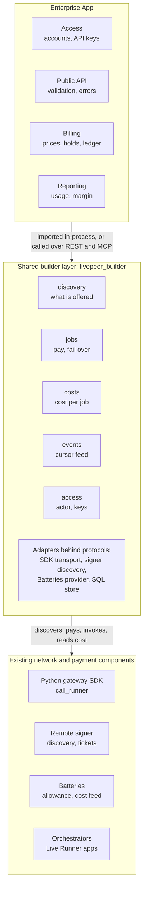

# Livepeer Builder Layer: Abstraction Design and Two-Application Review

> **Repository provenance — imported 1 October 2026.** Mike Zupper supplied this
> proposal from his local `blue-claw-network/livepeer-builder-layer-design.md`
> workspace and authorized its inclusion here. Source SHA-256:
> `fec3b89476351bd0fd321750fbd02084ff5d87955dca08c7e87bd1a73695cc1f`.
> The original document follows unchanged apart from this added provenance block.
> Its source reviews are dated October 1; it is subsequent analysis related to M1,
> not evidence of additional work completed in September. It proposes M2 interfaces
> and later extraction work, without changing the
> [accepted delivery baseline](../../product-specs/build-track-2026.md).
> Statements about application behavior, production use, forks and upstream
> acceptance remain author-reported until independently verified. Application
> names remain undisclosed as in the source. No code or source reuse rights are
> conveyed by importing this document. Read the separate
> [proposal assessment and M2 handoff](2026-10-01-Builder-Layer-Proposal-Assessment.md) for scope differences,
> technical questions and issue mapping.


**Status:** Draft for review by the Network Engineering SPE team\
**Date:** 1 October 2026\
**Author:** Mike Zupper

Two applications built on Livepeer were reviewed for this document. Neither is named, because the subject is the shared layer and not either product.

- **The Enterprise App** is an inference API product with customer accounts and retail billing. The design in this document is extracted from its code.
- **The second application** is a REST service that gives agent and web clients access to media-generation and tool capabilities. It was reviewed after the design was drafted, to test the design against code it was not extracted from.

## Summary

The Enterprise App already contains most of a builder engine. By my count, about one sixth of its API code exists only to talk to Livepeer, and the SDK is imported by just two files. This document proposes lifting that code into a shared package, working name `livepeer-builder`, that any Livepeer application can import or call as a service.

A builder works with six nouns: capability, offering, job, usage, network cost, and allowance. The layer hides everything beneath them: the 402 payment challenge, tickets, signer headers, manifest ids, orchestrator gRPC calls, the discovery wire format, and the Batteries cost feed.

```python
from livepeer_builder import BuilderEngine, JobRequest, LivepeerSettings

engine = BuilderEngine.from_settings(LivepeerSettings())  # signer, credential, database
await engine.start()                                       # discovery and cost sync begin

offerings = engine.discovery.offerings(capability="example:capability")

result = await engine.jobs.run(
    actor,                                # an ActorContext produced by the app's own auth
    JobRequest(
        capability="example:capability",  # any capability name a runner advertises
        model="example-model",
        path="/run",                      # the runner app's own route
        payload={"input": "..."},
        operation_ref="order-1234",       # makes a retry safe
    ),
)
cost = await engine.costs.for_job(result.job.id)  # pending until tickets are reported
```

The seam follows the baseline's commercial boundary. The shared layer answers what the network did and what it cost. The Enterprise App keeps who the customer is and what they are charged: accounts, API keys, the price sheet, holds, the ledger, the payment processor, and its public API routes.

The design covers the code the Enterprise App has today and marks the two baseline requirements it gives no evidence for: asynchronous jobs and persistent sessions. Nothing here changes code; it specifies the target for a later refactor.

The review of the second application confirms the core: both applications discover, select, pay, fail over, and attribute work in the same way. It also finds six gaps, most of which follow from one difference: the Enterprise App pays for every job from one funded account, and the second application has each caller pay with their own key. The gaps and proposed changes are in [Review against a second application](#review-against-a-second-application). None has been applied to the interfaces below.



Read it top to bottom. The Enterprise App calls five services, and only the adapter row knows the SDK, the signer, or Batteries.

## What the builder stack requires

The [accepted baseline](https://github.com/Cloud-SPE/Network-Engineering-SPE/blob/main/docs/design-docs/self-sovereign-open-builder-stack-draft.md) of 30 September 2026 asks for a noncommercial builder engine, shipped as installable Python packages and as runnable REST and MCP services. Enterprises extend it through public interfaces and never patch core. The [architecture companion](https://github.com/Cloud-SPE/Network-Engineering-SPE/blob/main/docs/design-docs/open-builder-architecture-and-sequences.md) adds the component and sequence detail. Nine requirements shape the layer proposed here.

| Requirement in the baseline | Consequence for this design |
| --- | --- |
| One core release serves two modes: imported in-process, or called as a deployed service | Every capability is a plain Python service class first; REST and MCP are thin adapters over the same classes |
| The engine reports wholesale network cost; the enterprise decides retail price | No price sheet, balance, hold, or invoice type appears in the shared layer |
| Access is a validated actor context; customer identity stays with the enterprise | The layer takes an opaque `ActorContext` and never sees a customer login |
| Discovery returns capabilities, input descriptions, network rates, units, and freshness | Discovery output is a typed snapshot with an observed-at time and a network rate per offering |
| Execution covers immediate results, asynchronous jobs, and persistent application endpoints; streaming is stretch scope | One job and attempt model covers all modes; streaming is designed in because the Enterprise App already depends on it |
| Jobs, attempts, payment references, and cost events are correlated explicitly | Every attempt records the orchestrator's manifest id, the key that joins a job to its network cost |
| Missing or late cost evidence is pending, never zero | Cost is a projection with a status: pending, observed, or corrected |
| Engine records sit behind a persistence interface; SQLite is required, PostgreSQL is stretch | Stores are protocols with a SQLite implementation and a PostgreSQL implementation that pass one contract suite |
| Payments run self-operated (Mode A) or through a hosted operator (Mode B) | One `PaymentProvider` protocol, with Batteries as the first implementation |

## The Enterprise App today

The Enterprise App touches Livepeer in eight places: three of its domains (catalog, inference, and network cost), the package its runner apps share, and one provisioning script.

| Concern | What the Enterprise App does today |
| --- | --- |
| Discovery | Polls the signer's `/discover-orchestrators` every 15 seconds, parses orchestrators and runners, and caches each orchestrator's ETH address from the SDK's `get_orch_info` for an hour |
| Runner metadata | Defines a JSON document of at most 1,024 bytes, versioned under an application-specific key, carrying capability, unit, models, and a size limit. One copy of the code builds it on the runner side, a second copy parses it on the gateway side |
| Health and selection | Cools a failing runner down from 5 seconds up to 5 minutes. Orders candidates by free capacity and drops runners whose advertised limit is below what the request needs |
| Paid call | Wraps the SDK's `call_runner` for JSON, multipart, and streaming bodies. Folds SDK errors into five reasons plus a flag saying whether payment was sent |
| Dispatch and failover | Tries up to 3 runners, moving on only before payment. Records runner, orchestrator, manifest id, attempt count, and first-byte time on the request record |
| Network cost | Pages the Batteries `/v1/cost/events` feed every 30 seconds, folds events into one record per manifest, drops duplicates by sequence number, and links each record to a request by manifest id |
| Payment provisioning | A script creates one grant, one allocation, and its API key through the Batteries command line. The key becomes the signer credential |
| Runner shell | A web server shell with a health route and a concurrency guard that answers 503 at capacity, so the gateway sees a full runner as a refusal |

The rest of the application (access, billing, usage reporting, administration, notifications) never touches Livepeer. Three properties of the current code shape the design:

1. **The dispatch loop is interleaved.** One function mixes generic steps (select, pay, fail over, record) with the Enterprise App's hold and settlement. The shared layer has to be something the app calls between its own steps.
2. **The request record mixes two kinds of fact.** Network facts (runner, manifest id, attempts) sit beside retail facts (held, charged, refunded). The baseline forbids an enterprise from writing engine tables, so the two must separate.
3. **The capability list is closed.** Six capability names and four units are hard-coded in both metadata copies. A shared layer must accept any capability name a runner advertises.

## The seam

The line falls where money changes meaning. What the network did and what it cost moves to the shared layer; who the customer is and what they are charged stays in the application.

| Concern | Shared layer | Stays in the Enterprise App |
| --- | --- | --- |
| Identity | An opaque `ActorContext`; optional operator-issued keys for the standalone service | Customer accounts, login, sessions, API keys, per-key permissions and spending limits, plans |
| Discovery | Orchestrators, runners, descriptors, network rates, freshness, runner health | Product catalog, display names, categories, recommendations, published limits, the public response shapes |
| Execution | Candidate selection, the paid call, failover before payment, first-byte timeout, jobs and attempts, a failure taxonomy | Request validation, the public API routes and error format, routing to non-Livepeer providers, the usage estimate |
| Usage | Measured usage per job, through a pluggable meter | Mapping usage to price dimensions |
| Money | Network cost per job with a status; the allowance | Price sheet, hold, settlement, ledger, the payment processor, refunds, measured margin |
| Reporting | A versioned event feed with a cursor | Customer usage, public statistics, admin views |
| Runner side | Server shell, descriptor builder, GPU probe | Model loading and the workload code of each runner app |

Three rules follow from the seam and govern every interface below.

1. **Composition, not callbacks.** The engine never calls application code in the middle of a job. The Enterprise App places its hold, calls `jobs.run`, and settles on the result. The same order works over HTTP, which is why one release can serve both integration modes.
2. **The engine speaks no application protocol.** A job is an HTTP request to a runner app at a path. A capability is any string of the form `namespace:name` that a runner advertises; the engine keeps no list of them. Knowledge of a capability's request and response bodies lives in a capability pack that each application owns.
3. **One key crosses the seam in each direction.** The application supplies `operation_ref`; the engine returns `job.id`. The manifest id, which joins a job to its tickets, stays inside the engine.

## Package layout

One repository holds three distributions, so an application installs only what it runs. All names are working names; the baseline lists the repository name as pending.

| Distribution | Import name | Owns | Depends on |
| --- | --- | --- | --- |
| `livepeer-builder-core` | `livepeer_builder` | Contracts, protocols, the services, the SQLite and PostgreSQL stores, the Batteries provider, test fakes | The `livepeer-gateway` SDK, pydantic, SQLAlchemy |
| `livepeer-builder-service` | `livepeer_builder_service` | REST adapter, MCP adapter, key authentication, the container image | Core, FastAPI, an MCP server library |
| `livepeer-builder-runner` | `livepeer_builder_runner` | Runner server shell, descriptor builder, GPU probe | FastAPI only; never core, so runner images stay small |

Core is split into modules with one-way imports, enforced by an import linter as the Enterprise App does today.

| Module | Holds | May import |
| --- | --- | --- |
| `contracts` | Every data model that crosses the boundary | Nothing |
| `protocols` | The seven extension interfaces | `contracts` |
| `discovery`, `jobs`, `costs`, `access`, `events` | One service each | `contracts`, `protocols` |
| `adapters.sdk` | `SignerDiscoverySource`, `SdkRunnerTransport` | The SDK. No other module imports `livepeer_gateway` |
| `adapters.batteries` | `BatteriesProvider` | Nothing else knows the Batteries wire format |
| `store` | `SqliteStore`, `PostgresStore`, migrations | `contracts`, `protocols` |
| `engine` | `BuilderEngine`, `LivepeerSettings`, wiring | Everything above |
| `testing` | In-memory store, static discovery, scripted transport, fake provider | `contracts`, `protocols` |

Shipping the fakes is deliberate. The Enterprise App's unit tier runs every service on an in-memory fake beside each real adapter, and builders need the same to test without a funded signer.

### What a capability pack is

A capability pack is the small set of functions that teaches the engine to read one application's capabilities. Each Enterprise App owns its own pack; the shared repository ships none.

A pack adds no feature to the engine. The engine can route, pay for, and deliver any job without understanding its body. Measuring usage is the one exception: the count of work done sits inside the response, in a shape only that capability defines.

A pack holds a `UsageMeter` for each capability the application serves, a stream scanner where responses stream, and the capability's input descriptions for discovery. Without a pack a job still runs and its network cost is still reported; only `job.usage` is empty.

| Example application | What its pack counts |
| --- | --- |
| Text and embedding inference API | Input and output tokens |
| Image and video generation API | Images or seconds generated, by resolution |
| Speech API | Audio seconds transcribed, characters synthesized |
| Video transcoding API | Seconds of output per rendition, or output pixels |
| Live video processing API | Seconds of stream processed in a session |
| Media analysis API | Minutes or frames analyzed |
| Training and batch compute API | GPU seconds |

Two applications that serve the same capabilities may share one pack as an ordinary Python package, but nothing in the engine depends on that. The transcoding row assumes the transcoder is offered as a runner app; the network's classic transcoding path does not go through `call_runner` and would need its own `RunnerTransport`.

### How a pack is deployed

A pack is never loaded at run time. It ships with a normal deploy, in one of three ways that follow from how the application integrates.

| Integration | Where the pack lives | How it reaches the engine |
| --- | --- | --- |
| Imported packages | In the application's own code | The app passes its meters to `BuilderEngine.from_settings(meters=...)` at startup. The pack deploys with the app |
| Deployed service, the app measures | In the application's backend | The service returns the runner's body untouched. The app measures usage itself and reports it with `POST /v1/jobs/{id}/usage` |
| Deployed service, the engine measures | In a container image the operator builds from the service image | The pack is installed as a Python package. The service finds its meters at startup through the entry point group `livepeer_builder.meters` |

The second row is the default for service mode, because it needs no custom image. In every row a changed pack takes effect on the next deploy or restart. The engine accepts reported usage once per job, from the job's owner, and only when no meter measured it.

Runtime code loading is left out on purpose. The baseline does not ask for it, and the engine process holds the signer credential.

## Classes and interfaces

A builder touches one facade and five services. An integrator who needs to swap a part implements one of seven protocols.

### The facade

```python
class BuilderEngine:
    discovery: DiscoveryService
    jobs: JobService
    costs: CostService
    access: AccessService
    events: EventFeed
    payments: PaymentProvider

    @classmethod
    def from_settings(
        cls,
        settings: LivepeerSettings,
        *,
        store: EngineStore | None = None,            # default: built from settings.database_url
        authenticator: Authenticator | None = None,  # default: KeyAuthenticator over the store
        meters: Sequence[UsageMeter] = (),
        selection: SelectionPolicy | None = None,    # default: MostCapacityFirst
        discovery_source: DiscoverySource | None = None,
        transport: RunnerTransport | None = None,
        payments: PaymentProvider | None = None,
        clock: Clock | None = None,
    ) -> BuilderEngine: ...

    async def start(self) -> None: ...  # one discovery poll, then the poller and the cost sync worker
    async def stop(self) -> None: ...
    def health(self) -> EngineHealth: ...
```

### The services

```python
class DiscoveryService:
    @property
    def snapshot(self) -> DiscoverySnapshot: ...
    def is_fresh(self) -> bool: ...                    # observed within three poll intervals
    async def refresh(self) -> DiscoverySnapshot: ...  # one poll now
    def offerings(self, *, capability: str | None = None, model: str | None = None) -> list[Offering]: ...
    def runners(self, app: str, *, min_limits: Mapping[str, int] | None = None) -> list[RunnerView]: ...
    def resolve_app(self, capability: str, model: str) -> str | None: ...


class JobService:
    async def run(self, actor: ActorContext, request: JobRequest) -> JobResult: ...
    async def stream(self, actor: ActorContext, request: JobRequest) -> JobStream: ...
    async def submit(self, actor: ActorContext, request: JobRequest) -> Job: ...  # returns at once
    async def get(self, actor: ActorContext, job_id: UUID) -> Job: ...
    async def result(self, actor: ActorContext, job_id: UUID) -> JobResult: ...
    async def list(self, actor: ActorContext, *, before: datetime | None = None, limit: int = 50) -> list[Job]: ...
    async def report_usage(self, actor: ActorContext, job_id: UUID, usage: Mapping[str, int]) -> Job: ...  # the app measured it


class JobStream:                         # returned once the first byte has arrived
    job: Job
    status_code: int
    content_type: str
    def __aiter__(self) -> AsyncIterator[bytes]: ...
    async def aclose(self) -> Job: ...   # the final job, with state and measured usage


class CostService:
    async def sync_once(self) -> SyncReport: ...
    async def for_job(self, job_id: UUID) -> JobCost: ...
    async def for_jobs(self, job_ids: Sequence[UUID]) -> dict[UUID, JobCost]: ...
    async def summary(self, *, start: datetime, end: datetime, actor_id: str | None = None) -> CostSummary: ...


class AccessService:
    async def issue_key(self, actor_id: str, *, scopes: Iterable[str], label: str = "") -> IssuedKey: ...
    async def revoke_key(self, key_id: str) -> None: ...
    async def authenticate(self, token: str) -> ActorContext: ...


class EventFeed:
    async def after(self, cursor: int, *, limit: int = 500) -> EventPage: ...
```

### The extension protocols

```python
class DiscoverySource(Protocol):
    async def fetch(self) -> list[Orchestrator]: ...

class RunnerTransport(Protocol):         # both raise RunnerCallError(reason, payment_sent, status, body)
    async def call(self, runner: Runner, request: JobRequest) -> RunnerReply: ...
    async def call_stream(self, runner: Runner, request: JobRequest) -> RunnerStream: ...

class SelectionPolicy(Protocol):
    def order(self, candidates: Sequence[RunnerView], request: JobRequest) -> Sequence[Runner]: ...

class UsageMeter(Protocol):
    capability: str
    def measure(self, request: JobRequest, reply: RunnerReply) -> Usage | None: ...
    def scanner(self, request: JobRequest) -> StreamScanner: ...  # feed(chunk); finish() -> Usage | None

class PaymentProvider(Protocol):
    async def credential(self) -> SignerCredential: ...   # what the transport presents to the signer
    async def allowance(self) -> Allowance: ...
    async def provision(self, spec: AllocationSpec) -> ProvisionedAllocation: ...
    async def fund(self, allocation_id: str, amount: Money) -> None: ...
    async def revoke(self, allocation_id: str) -> None: ...
    async def cost_events(self, after: int, limit: int = 500) -> CostEventPage: ...
    async def manifest_cost(self, manifest_id: str) -> ManifestCost | None: ...

class Authenticator(Protocol):
    async def authenticate(self, credentials: Credentials) -> ActorContext: ...

class EngineStore(Protocol):             # a session exposes .jobs, .costs, .access, .events, .discovery
    def begin(self) -> AbstractAsyncContextManager[StoreSession]: ...
```

| Protocol | Default implementation | What it generalizes in the Enterprise App |
| --- | --- | --- |
| `DiscoverySource` | `SignerDiscoverySource`, `StaticDiscoverySource` | The signer discovery client, its static test double, and the orchestrator address lookup |
| `RunnerTransport` | `SdkRunnerTransport` | The SDK call wrapper and its error classification |
| `SelectionPolicy` | `MostCapacityFirst` | The candidate sort by free capacity |
| `UsageMeter` | None in core; the application's capability pack supplies one per capability | The functions that read usage from a response body or a stream |
| `PaymentProvider` | `BatteriesProvider` | The Batteries cost feed client and the provisioning script |
| `Authenticator` | `KeyAuthenticator` | New. The Enterprise App supplies its own context and uses none |
| `EngineStore` | `SqliteStore`, `PostgresStore`, `MemoryStore` | The pattern of a repository protocol, a SQL implementation, and an in-memory fake |

### Errors

```python
class BuilderError(Exception): ...
class AccessDenied(BuilderError): ...         # bad credential, missing scope, or another actor's job
class JobFailed(BuilderError): ...            # carries .job and .failure; switch on failure.kind
class OperationExists(BuilderError): ...      # carries .job: this operation_ref was already used
class ProviderUnavailable(BuilderError): ...  # the cost feed or management API cannot be reached
```

### Behavior the contract fixes

Five rules are part of the interface, because each one protects against a duplicate charge or a false zero.

1. A job moves to another runner only while no payment has been sent and the failure is `refused` or `unreachable`. Once tickets go out, the job is bound to that runner. This is the Enterprise App's failover rule, unchanged.
2. One `(application_id, actor_id, operation_ref)` dispatches at most once. A second call raises `OperationExists` with the first job.
3. Each attempt is written before the call and updated after it, so a restart finds what was in flight. A job whose payment went out but whose outcome is unknown ends as `uncertain`, never `failed`.
4. A stream is returned only after its first byte. No byte within `first_byte_timeout_s` fails the job as `timeout` with `response_started` false.
5. A cost that has not arrived is `pending`. Only a job that never reached payment has cost status `none`.

### Sessions

The baseline requires persistent application endpoints. The SDK supports them through `reserve_session`, so the engine reserves a seventh attribute, `engine.sessions`, with `open(actor, SessionRequest) -> Session` and `Session.aclose()`. The Enterprise App has no session code and no asynchronous jobs. `sessions`, `submit`, and `result` are therefore specified from the SDK alone and need a representative capability before they are frozen.

## Data contracts

Every contract is a frozen pydantic v2 model. The class a Python caller receives in-process is the same class that produces the JSON schema for REST and MCP, so the two modes cannot drift. Money is a `Decimal`, serialized as a string. Times are UTC. Ids the engine mints are UUIDs.

### Access

```python
class ActorContext(Contract):
    actor_id: str                       # opaque to the engine; the owner of jobs and events
    application_id: str = "default"     # isolates applications that share one engine
    scopes: frozenset[str]              # "discover", "jobs:run", "jobs:read", "admin"
    attributes: Mapping[str, str] = {}  # carried onto jobs and events, never interpreted
```

### Discovery

```python
class NetworkRate(Contract):
    amount: Decimal                     # as the orchestrator advertises it
    currency: str                       # "usd" today
    unit: str                           # "hour" today for Live Runner apps

class ModelSpec(Contract):
    id: str
    name: str | None = None
    description: str | None = None
    extra: Mapping[str, Any] = {}

class RunnerDescriptor(Contract):       # the metadata document; at most 1,024 bytes encoded
    schema_version: int                 # 1
    capability: str                     # "namespace:name"
    unit: str                           # what the runner's work is counted in
    models: tuple[ModelSpec, ...]
    limits: Mapping[str, int] = {}      # named integer limits, such as max_input
    extra: Mapping[str, Any] = {}

class Runner(Contract):
    runner_url: str
    orchestrator_url: str
    orchestrator_address: str | None    # ETH address, cached for an hour
    app: str
    mode: str                           # "single-shot" or a session mode
    capacity: int
    capacity_available: int
    version: str | None
    rate: NetworkRate | None
    descriptor: RunnerDescriptor | None
    descriptor_error: str | None        # why the document did not parse

class RunnerView(Contract):             # a runner plus what the engine knows of its health
    runner: Runner
    status: Literal["ready", "busy", "cooldown", "excluded"]
    reason: str | None
    consecutive_failures: int
    cooldown_until: datetime | None
    last_failure_at: datetime | None
    last_success_at: datetime | None

class Orchestrator(Contract):
    url: str
    address: str | None
    last_seen: datetime | None
    runners: tuple[Runner, ...]

class DiscoverySnapshot(Contract):
    orchestrators: tuple[Orchestrator, ...]
    observed_at: datetime | None        # None before the first success
    last_attempt_at: datetime | None
    last_error: str | None

class Offering(Contract):               # one app, as a builder sees it
    app: str
    capability: str
    unit: str
    models: tuple[ModelSpec, ...]
    rate_low: NetworkRate | None        # the cheapest and dearest advertised rate
    rate_high: NetworkRate | None
    runner_count: int
    ready_count: int
    limits: Mapping[str, int]           # the lowest value any ready runner states
    observed_at: datetime
```

The descriptor is the Enterprise App's metadata document under a neutral key. The wire form replaces the application-specific version key with `"lpb": 1` and moves the size limit under `limits`. The parser accepts the old form until every runner has been redeployed. The `capability` field takes any name; the engine validates its form and never checks it against a list.

### Jobs

```python
class JobRequest(Contract):
    capability: str | None = None       # with model, resolved to an app through descriptors
    model: str | None = None
    app: str | None = None              # or name the app directly
    path: str                           # appended to the runner URL
    method: str = "POST"
    payload: Mapping[str, Any] | None = None
    multipart: MultipartBody | None = None
    operation_ref: str | None = None    # the caller's key: makes a retry safe, joins to the caller's records
    min_limits: Mapping[str, int] = {}  # skip runners that state a lower limit
    max_attempts: int = 3
    timeout_s: float = 300.0
    first_byte_timeout_s: float = 30.0

class Attempt(Contract):
    number: int
    runner_url: str
    orchestrator_url: str
    orchestrator_address: str | None
    manifest_id: str | None             # joins the attempt to its network cost
    payment_sent: bool
    outcome: Literal["succeeded", "refused", "unreachable", "payment", "timeout", "http", "interrupted"]
    status_code: int | None
    started_at: datetime
    ended_at: datetime | None

class Failure(Contract):
    kind: Literal["no_offering", "no_capacity", "refused", "unreachable", "payment",
                  "timeout", "runner_rejected", "runner_error", "interrupted"]
    message: str
    status_code: int | None             # the runner's own status, when it answered
    body: bytes | None                  # the runner's own words, bounded
    content_type: str | None
    payment_sent: bool
    response_started: bool

class Job(Contract):
    id: UUID
    actor_id: str
    application_id: str
    operation_ref: str | None
    app: str | None
    capability: str | None
    model: str | None
    state: Literal["pending", "running", "succeeded", "failed", "uncertain"]
    attempts: tuple[Attempt, ...]
    usage: Mapping[str, int] | None     # None when no meter is registered or the runner reported none
    failure: Failure | None
    created_at: datetime
    first_byte_at: datetime | None
    completed_at: datetime | None

class JobResult(Contract):
    job: Job
    status_code: int
    content: bytes
    content_type: str
    data: Mapping[str, Any] | None      # parsed when the runner answered JSON
```

`runner_rejected` is a 4xx from the runner: the caller's mistake, forwarded with the runner's body. `runner_error` is a 5xx. `no_offering` means nothing advertises the capability and model; `no_capacity` means something does and none is ready.

### Cost and allowance

```python
class JobCost(Contract):
    job_id: UUID
    status: Literal["none", "pending", "observed", "corrected"]
    fee_wei: Decimal | None             # None while pending
    fee_usd: Decimal | None             # None unless the provider priced every event
    billable_seconds: Decimal | None
    ticket_count: int
    event_count: int
    first_signed_at: datetime | None
    last_signed_at: datetime | None
    synced_at: datetime | None

class CostSummary(Contract):
    start: datetime
    end: datetime
    fee_wei: Decimal
    fee_usd: Decimal | None
    billable_seconds: Decimal
    jobs_with_cost: int
    jobs_pending: int                   # reported beside the total, never folded into it
    last_synced_at: datetime | None

class Allowance(Contract):              # fields follow what the provider reports
    allocation_id: str
    status: str
    granted: Money
    spent: Money
```

`JobCost` is the Enterprise App's per-manifest cost record, keyed by job instead. A job with several paid attempts sums their manifests. `corrected` marks a cost that changed after it was first reported, which happens when a metered runner keeps funding a long call.

### Events

```python
class EngineEvent(Contract):
    sequence: int                       # the cursor; strictly increasing
    id: str                             # stable; consumers drop duplicates on it
    type: Literal["job.created", "job.finished", "usage.reported", "cost.observed", "cost.corrected"]
    schema_version: int
    occurred_at: datetime
    job_id: UUID
    actor_id: str
    application_id: str
    operation_ref: str | None
    payload: Mapping[str, Any]          # the Job for job events, the JobCost for cost events

class EventPage(Contract):
    events: tuple[EngineEvent, ...]
    next_cursor: int
```

### Settings and stored records

```python
class LivepeerSettings(BaseSettings):   # environment prefix LIVEPEER_
    signer_url: str | None = None
    signer_credential: SecretStr | None = None  # the provider-issued key the signer authorizes
    discovery_url: str | None = None            # overrides the signer's discovery endpoint
    discovery_interval_s: float = 15.0
    verify_tls: bool = True
    provider_url: str | None = None             # cost feed and management API
    provider_token: SecretStr | None = None
    cost_sync_interval_s: float = 30.0
    database_url: str = "sqlite+aiosqlite:///builder.db"
    max_attempts: int = 3
    first_byte_timeout_s: float = 30.0
    request_timeout_s: float = 300.0
```

The store owns seven tables, all prefixed `lpb_` so they can share a database with application tables: `lpb_jobs`, `lpb_attempts`, `lpb_network_costs`, `lpb_cost_cursor`, `lpb_events`, `lpb_access_keys`, and `lpb_orchestrators`. The cursor gets its own row. The Enterprise App derives its cursor from the newest stored cost, so a run of skipped events is read again on every tick.

## Service and HTTP interfaces

The service package exposes the same services over REST and MCP. Each route or tool is one service call, made with the `ActorContext` the authenticator returned, and returns the contract models above as JSON.

### REST

| Method and path | Service call | Scope |
| --- | --- | --- |
| `GET /v1/offerings?capability=&model=` | `discovery.offerings` | `discover` |
| `GET /v1/offerings/{app}/runners` | `discovery.runners` | `discover` |
| `POST /v1/jobs` | `jobs.run`; `jobs.stream` when the body sets `"stream": true`; `jobs.submit` when it sets `"mode": "async"`, answered 202 | `jobs:run` |
| `GET /v1/jobs`, `GET /v1/jobs/{id}` | `jobs.list`, `jobs.get` | `jobs:read` |
| `GET /v1/jobs/{id}/result` | `jobs.result` | `jobs:read` |
| `POST /v1/jobs/{id}/usage` | `jobs.report_usage` | `jobs:run` |
| `GET /v1/jobs/{id}/cost` | `costs.for_job` | `jobs:read` |
| `GET /v1/costs/summary?start=&end=` | `costs.summary` | `jobs:read` for the caller's own jobs, `admin` for all |
| `GET /v1/events?after=&limit=` | `events.after` | `admin` |
| `POST /v1/keys`, `POST /v1/keys/{id}/revoke` | `access.issue_key`, `access.revoke_key` | `admin` |
| `GET /v1/allowance` | `payments.allowance` | `admin` |
| `GET /livez`, `GET /readyz`, `GET /metrics` | `engine.health` | None |

A `POST /v1/jobs` body is a `JobRequest`. A multipart job sends the `JobRequest` as a JSON part named `job` beside its file parts. A synchronous or streamed job answers with the runner's own status, content type, and body, plus a `Livepeer-Job-Id` header, so a proxying application forwards bytes untouched. A failed job answers with the `Failure` as JSON.

### MCP

| Tool | Service call |
| --- | --- |
| `list_offerings` | `discovery.offerings` |
| `run_job` | `jobs.run`, or `jobs.submit` for a long job |
| `get_job` | `jobs.get` and `jobs.result` |
| `get_job_cost` | `costs.for_job` |
| `get_cost_summary` | `costs.summary` |

An enterprise adds routes and tools by mounting its own beside these on the same application object. It does not subclass or patch the adapters.

### Events

`GET /v1/events` and `EventFeed.after` return the same pages. A consumer saves `next_cursor` after it has applied a page, and drops any event whose `id` it has seen. The engine keeps the events table as the single source, so a consumer that lost its cursor can replay from zero.

### Metrics

The engine exports the counters the Enterprise App already defines for its Livepeer code, under an `lpb_` prefix: discovery failures and last success, dispatch refusals by reason, attempts by orchestrator and outcome, failovers, cost sync events by status, last cost sync, and manifests not yet linked to a job.

### Upstream interfaces the layer wraps

| Component | Interface | Used by |
| --- | --- | --- |
| Remote signer | `GET /discover-orchestrators` | `SignerDiscoverySource` |
| Python SDK | `call_runner` with JSON, multipart, and `stream=True`; `get_orch_info`; `reserve_session` | `SdkRunnerTransport`, `SignerDiscoverySource`, sessions |
| Batteries read API | `GET /v1/cost/events?after=&limit=`, `GET /v1/cost/manifests/{manifest_id}` | `BatteriesProvider.cost_events`, `manifest_cost` |
| Batteries management API | `POST /v1/grants`, `POST /v1/allocations`, `POST /v1/api-keys`, `POST /v1/allocations/{id}/fund`, `POST /v1/allocations/{id}/revoke`, `GET /v1/allocations/{id}` | `BatteriesProvider.provision`, `fund`, `revoke`, `allowance` |

Multipart bodies and the TLS flag are still only on the Enterprise App's SDK fork. `payment_sent`, the stream manifest id, failure classification, and `payment_sent` on rejections are in draft [livepeer-python-gateway#71](https://github.com/livepeer/livepeer-python-gateway/pull/71) (`5868d81` on `feat/call-runner-manifest-id`), rebased onto upstream `main` and not merged. Runner selection pool size and ordering remain [livepeer-python-gateway#70](https://github.com/livepeer/livepeer-python-gateway/issues/70). The Batteries manifest id and usage read are on `main` at `501c1ed`. The signer's event delivery guarantee is still open ([go-livepeer#4100](https://github.com/livepeer/go-livepeer/issues/4100)). The engine cannot depend on a released SDK for the unmerged fields.

## The Enterprise App on the new layer

The Enterprise App adopts the layer in imported mode on its existing PostgreSQL database, and every public route keeps its response shape. The Livepeer-facing code in three domains leaves the repository; the domains that hold the product stay whole.

### Where each module goes

| The Enterprise App today | After the refactor |
| --- | --- |
| Discovery client, poller, runner health tracker, metadata parser | Deleted. Replaced by `engine.discovery` and `RunnerDescriptor` |
| Catalog service: the poll, the parsers, candidate selection | Deleted. The product catalog, availability view, and recommendations stay and read `engine.discovery.snapshot` and `runners(app, min_limits=...)` |
| Types for discovered runners, orchestrators, and the snapshot | Replaced by `Runner`, `Orchestrator`, `DiscoverySnapshot`, `RunnerDescriptor`. Catalog and price types stay |
| SDK call wrapper and error classification | Deleted. Replaced by `SdkRunnerTransport`, `RunnerReply`, `Failure` |
| Request service: the attempt loops, failover check, first-byte wait, dispatch record | Replaced by one call to `engine.jobs.run` or `engine.jobs.stream`. Validation, the hold, settlement, and error mapping stay |
| Usage extraction from responses and streams | Stays in the app as its capability pack: `UsageMeter` implementations. The pre-call estimate stays; it sizes a retail hold |
| Public error format, routing to non-Livepeer providers | Stay. They are the app's product |
| Dispatch fields written by the request service | The app copies the facts it reports on from the returned `Job` |
| Batteries feed client, sync worker, the fold into per-manifest costs | Deleted. Replaced by `BatteriesProvider` and `engine.costs` |
| Margin and wholesale reports | Stay. Margin compares retail to network cost, so it belongs to the application |
| Shared runner package | Deleted. Each runner app imports `livepeer_builder_runner` |
| Batteries provisioning script | Replaced by a command over `PaymentProvider.provision` |
| Signer and Batteries settings | Replaced by a nested `LivepeerSettings` |
| Access, billing, usage reporting, administration, notifications | Unchanged |

### One request after the refactor

1. The Enterprise App authenticates the caller's API key and builds an `ActorContext`, with the customer's id as `actor_id` and the key's id as an attribute.
2. It validates the body and computes its usage estimate. It asks `engine.discovery.resolve_app` whether the model is served and checks the request against the limits it publishes. An unknown model is still refused before any hold.
3. Billing opens the request and places the hold. The request id becomes the `operation_ref`.
4. The app calls `engine.jobs.run` with the capability, model, path, body, and `min_limits={"max_input": n}`.
5. The engine resolves the app, orders the candidates, pays, fails over before payment, records each attempt, and measures usage with the meters the app registered.
6. On a `JobResult`, the app charges from `job.usage`, or from its estimate when usage is `None`. On `JobFailed`, it releases the hold unless `failure.response_started`, and maps `failure.kind` to its own error format.
7. Later, the app's event consumer reads `cost.observed` and writes the network cost beside the request, where the margin reports find it.

### How failures map

| `failure.kind` | Enterprise App response today |
| --- | --- |
| `no_offering` | 404, unknown model |
| `no_capacity`, or `refused` and `unreachable` on every attempt | 503 with `Retry-After: 5` |
| `payment` | 503 with `Retry-After: 10` |
| `timeout` | 504 |
| `runner_rejected` | The runner's 4xx, forwarded with its body |
| `runner_error` | 502 |
| `interrupted` | The stream ends; the request is charged as delivered and marked interrupted |

Every row the Enterprise App produces today has a `Failure` kind, which is the test that the taxonomy is sufficient.

### What changes in the schema

The request record keeps its shape. Its dispatch fields (runner, orchestrator, orchestrator address, manifest id, attempt count, first-byte time) are filled from the returned `Job` instead of by the dispatch loop, and a job id is added. The per-manifest cost record is rekeyed from manifest to job and filled from the event feed instead of from Batteries. The Enterprise App never reads or writes an `lpb_` table.

## Review against a second application

The design holds for the second application's core path, and six parts of it need to change. This section records what that application does, where the two applications agree, and each gap with a proposed change.

### What the second application is

It is one REST service that wraps the Python gateway SDK for thin clients: an MCP server, a web application, and a command-line tool.

- **AI capabilities** go to Live Runner apps through `call_runner`.
- **Tool capabilities** (media processing and similar deterministic tools) and training jobs go over the BYOC protocol to tool hosts that run off-chain.
- **Payment** goes through a hosted signer. The service forwards each caller's own bearer key to that signer, so the caller's account pays. It does not use Batteries.
- **State** lives in process memory. Finished asynchronous jobs are mirrored to durable storage. There is no database and no record of usage or network cost.

### Where both applications do the same thing

| Concern | The Enterprise App | The second application | Verdict on the design |
| --- | --- | --- | --- |
| Paid call | `call_runner` with a signer URL and signer headers | The same call | Fits both |
| Failover | Up to 3 runners, only before payment, decided by the SDK's `payment_sent` flag | Up to 3 nodes, only before payment, decided by matching the error text | Fits both. The flag is the safer test |
| Discovery parsing | Orchestrators and their runners: app, mode, capacity, price | The same wire shape | Fits both |
| Candidate selection | Most free capacity first; cooling runners skipped | An allow-list per capability, then a ranking by price, free capacity, and latency | The pluggable `SelectionPolicy` fits; gap 3 covers the allow-list |
| Attribution | Runner, orchestrator, address, and manifest id stored on the request | The serving orchestrator returned on every response and every error | Fits both through `Attempt` |
| Failure taxonomy | Five reasons mapped to HTTP errors | A failure kind plus a hint saying whose fault it is | Mostly fits; see the smaller gaps |
| Usage in the response body | Token and unit counts | Token counts from AI runners; a metered unit count and unit kind from tools | Confirms the usage meter: the count sits in the body, in a shape each capability defines |
| Runner shell | Web server, health route, capacity refusal as 503 | The same pattern | Fits both |
| TLS toward orchestrators | Verification off for self-signed certificates | The same | Fits through `verify_tls` |
| Long jobs | A per-request timeout, 300 seconds by default | A caller-set timeout with a 600-second floor; training jobs run up to an hour | Fits through `timeout_s` |

### Evidence the second application adds

The Enterprise App gave no evidence for two baseline requirements. The second application runs both in production.

- **Asynchronous jobs.** A submit route returns a job id at once and a poll route returns the result. Finished results are mirrored to durable storage and kept for 30 minutes. A restart loses jobs that were still running.
- **Idempotency.** A caller sends an idempotency key. A repeat of the same key joins the running or recently finished job for 15 minutes, scoped to the caller.

These support `jobs.submit`, `jobs.get`, `jobs.result`, and `operation_ref`. Persistent sessions still have no evidence: the second application's live video endpoints are being retired.

### Gaps and proposed changes

| # | Gap | What the second application does | Proposed change |
| --- | --- | --- | --- |
| 1 | Who pays is decided per request | Forwards each caller's own bearer key to the signer, so the caller's account pays. A key that matches no accepted pattern is refused before dispatch | Let the signer credential come from the `ActorContext`, with the settings value as the default. `PaymentProvider.credential` takes the actor |
| 2 | Cost reporting assumes Batteries | Has no cost feed and records no network cost | A `PaymentProvider` declares what it supports. Add a `JobCost` status `unavailable`, distinct from `pending` |
| 3 | The capability-to-app mapping lives in operator configuration | A configuration table maps each capability to an app, a path, and the orchestrators allowed to serve it. Runners publish no descriptor. A caller may pin one orchestrator | Make app resolution a protocol with two implementations: runner descriptor and configuration table. Add `allowed_orchestrators` to `JobRequest` |
| 4 | Idempotency semantics | A repeated call joins the running job and receives the same result. A refusal before dispatch is forgotten, so the retry runs | Replace "raise `OperationExists`" with join-and-return. Release the `operation_ref` when a job failed with no payment sent |
| 5 | A second transport | Sends tool capabilities and training jobs over the BYOC protocol, to hosts chosen from a static map | Decide whether BYOC is in scope. If it is, it becomes a second `RunnerTransport` with static targets |
| 6 | Admission limits | Caps total concurrent jobs, and caps concurrent jobs per capability where an upstream provider enforces its own limit. A request over a cap is refused with 503 before dispatch | Add optional global and per-capability limits to the engine. In service mode the application cannot enforce them itself |

Gap 1 matters most. It is the baseline's open question of per-application versus per-actor payment, and the two applications sit on opposite sides of it.

Six smaller gaps need no change of shape:

- **Runner registration.** Its runners register through the SDK's `register_runner` at startup, retry on failure, and deregister at shutdown. The runner package covers only static registration and needs a registration helper.
- **Discovery source.** It reads a list of orchestrator `/discovery` URLs plus a remote registry, on every request. The `DiscoverySource` protocol covers this, but a URL-list implementation is missing. Polling, as the Enterprise App does, would also remove the fetch from the request path.
- **Ranking data.** Ranking by price and latency needs a latency measurement per orchestrator, which the engine does not keep.
- **Progress for long jobs.** It sends one-second heartbeats over server-sent events while a job runs. The service adapter has no equivalent; a `GET /v1/jobs/{id}/events` route would supply one.
- **Failure kinds.** It separates "capability not configured", "configured but no runner advertises it", and "upstream provider queue full". The first two collapse into `no_offering` and the third into `refused`.
- **Unpaid dispatch.** Some of its runners are called with no payment. The engine has one payment mode for every job.

### What stays in the second application

Key classification and its refusal messages, per-capability payload shaping (injecting a model id, renaming fields, turning a URL input into inline bytes), response shaping, the planning endpoints that call a language model, file staging, and its admin and debug routes are product code. They correspond to the Enterprise App's billing and public API.

### What the second application would gain

- **Durable jobs.** Its own documents note that a restart loses work in flight. Stored jobs and attempts remove that.
- **Usage and cost records.** It records neither today.
- **One failover test.** The SDK's `payment_sent` flag replaces matching on error text.
- **A runner descriptor.** Published by the runner, it could replace the capability table kept by hand.

## Extraction path

The code moves in eight steps, each one a copy into the new repository with its tests, then a switch in the Enterprise App, then a deletion. The app's frozen contract tests are the regression gate at every step, and production keeps the current code until step 7.

| Step | What moves | How it is verified | Baseline milestone it fits |
| --- | --- | --- | --- |
| 1. Contracts | `contracts`, `protocols`, `testing` fakes, and a store contract suite | Strict type checking; the suite passes on `MemoryStore` and `SqliteStore` | M2, foundation and integration contracts |
| 2. Discovery | Signer source, parsers, descriptor, health tracker, poller | The Enterprise App's discovery tests pass against `engine.discovery`; the model list from the development stack is identical before and after | M2 |
| 3. Execution | SDK transport, error classification, the attempt loop, jobs and attempts | The app's failover unit tests, ported; one paid call end to end; a retry with the same `operation_ref` produces one job and one payment | M3, complete builder journey |
| 4. Cost and events | Batteries provider, the fold, the cursor, the event feed | A recorded feed replays to the same per-manifest totals the app stores today; duplicate and late events change nothing twice | M3 |
| 5. Runner package | Server shell, descriptor builder, GPU probe | Each runner app's tests pass on the new import; the parser reads both descriptor forms | M3 |
| 6. Service adapters | REST, MCP, key authentication, `SqliteStore` migrations | The store suite passes on PostgreSQL; the journey test passes through HTTP and through pinned MCP clients | M3 to M4 |
| 7. Enterprise App adoption | The app imports the released packages and deletes its copies | The app's full gate, its integration tier, and the migration rehearsal on a production dump | M4, reuse and reliability |
| 8. Provisioning and release | `PaymentProvider` management calls, the command line, containers | A fresh install provisions an allowance and runs the journey with no manual step | M4 to M5 |

Steps 2 to 5 carry existing, tested code. Steps 1, 6, and 8 are new code with no Enterprise App source, and asynchronous jobs and sessions are new in step 3. Those are where the estimate risk sits.

The milestone column is a suggested fit against the accepted M1 to M5 plan, not a commitment recorded there.

## Open decisions

Eleven questions need an owner's call before the interfaces are frozen. Each carries a recommendation so work can proceed on a default. The remaining gaps from the second review are proposed changes, listed in that section.

| Decision | Options | Recommendation |
| --- | --- | --- |
| Names of the repository, distributions, and the `lpb` prefix | The working names here, or names chosen with the Livepeer organization | Decide before step 1 ships; a rename after release breaks every importer |
| How usage is measured in service mode | The app measures and reports back, a custom image with the pack installed, or a declarative field mapping in configuration | The app measures and reports back by default; the custom image for operators who want the engine to measure. A declarative mapping is not designed here |
| How a capability resolves to an app | A descriptor the runner publishes, as the Enterprise App does; a configuration table the operator keeps, as the second application does; or both | Both, behind one resolver protocol. Ship descriptor schema 1 from the Enterprise App's document under a neutral key |
| How an application joins retail records to network facts | An event-fed copy in its own tables, read-only database views, or its own `EngineStore` over its tables | The event-fed copy. It is the only option that also works in service mode |
| Allocation granularity | One allocation per application, or one per actor | One per application as the default, which is the Enterprise App's standing decision. `provision` takes an `AllocationSpec` so per-actor remains possible |
| Streaming in core | Stretch scope as the baseline says, or included from the first release | Included. The Enterprise App depends on it and the code exists |
| Asynchronous jobs, stored results, and sessions | Design now from the SDK, or wait for a representative capability | Reserve the interfaces now; freeze them only after one real capability exercises them. Where a large result is stored is undecided |
| Hosted payment operator (Mode B) | Reuse the Batteries read and management APIs with scoped tokens, or a separate provider contract | Unknown. Whether a hosted operator can scope the cost feed to one credential needs the Batteries maintainers |
| Upstream merges | Depend on forks, or wait for releases | Send the three accepted change requests now. The engine pins forks until they merge, and says so in its release notes |
| Who pays | One signer credential for the whole application, or a credential per caller carried on the request | Support both: the settings value as the default, an override from the `ActorContext`. The two reviewed applications sit on opposite sides of this choice |
| BYOC protocol in scope | Live Runner only, or a second transport for BYOC tool capabilities and training jobs | Live Runner only in the first release. Keep `RunnerTransport` free of Live Runner assumptions so BYOC can be added |

## Sources

- [Self-Sovereign Open Builder Stack](https://github.com/Cloud-SPE/Network-Engineering-SPE/blob/main/docs/design-docs/self-sovereign-open-builder-stack-draft.md), accepted baseline, updated 1 October 2026
- [Open Builder Engine: Architecture and Sequences](https://github.com/Cloud-SPE/Network-Engineering-SPE/blob/main/docs/design-docs/open-builder-architecture-and-sequences.md)
- [Console capability and gap matrix](https://github.com/Cloud-SPE/Network-Engineering-SPE/blob/main/docs/design-docs/console-capability-and-gap-matrix.md), execution baseline
- [Build Track task breakdown](https://github.com/Cloud-SPE/Network-Engineering-SPE/blob/main/docs/design-docs/build-track-december-2026-task-breakdown-draft.md), milestones M1 to M5
- The Enterprise App's source code, reviewed 1 October 2026
- The second application's source code and operating documents, reviewed 1 October 2026
- The source of the Python gateway SDK and Clearinghouse Batteries, including the changes the Enterprise App carries on forks
